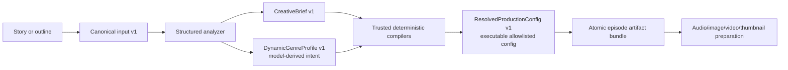

# Dynamic Generic Genre

## Purpose and trust boundary

`@mediaforge/dynamic-genre` analyzes a completed story or structured outline once and compiles it into a safe production configuration. Existing Dark Truth/Horror, mathematics, and Strategic Reinvention/Veronica paths remain separate first-class profiles.



The model may return only strict semantic enums, bounded numbers, short descriptions, evidence, continuity anchors, and safety signals. Unknown keys fail validation. It cannot provide providers, endpoints, models, personal voice IDs, paths, templates, commands, FFmpeg/CSS/code fragments, destinations, credentials, retries, or costs. Trusted code ignores the model's base-profile hint and derives the executable profile from semantic genre IDs.

No cloned or named personal voice is inferred. Dynamic CLI resolution always emits `system-non-personal-default`. A future trusted caller may mark a voice `operator-authorized` only after the existing consent/profile policy selected it; the dynamic profile never names that voice. Veronica remains voice-disabled and production-blocked until her dedicated policy is activated.

## Contracts and artifacts

All schemas use strict Zod validation.

- `CreativeBrief` schema `1.0`: audience, genre/mix, tone, pacing, arc, POV, themes, setting, characters/visual anchors, locations, objects, continuity, safety, motifs, audio/thumbnail intent, duration, density, warnings, and bounded evidence.
- `DynamicGenreProfile` schema `1.0`: semantic classification plus allowlisted audience, narrative, visual, audio, thumbnail, production, and safety intent.
- `ResolvedProductionConfig` schema `1.0`: trusted provider policies, non-personal voice boundary, render/prompt presets, scene/image/duration limits, retry/cost ceilings, locale resolution, and `autoPublish: false`.
- `DynamicGenreProvenance` schema `1.0`: input/revision, schema/prompt/analyzer/policy versions, provider metadata, timestamp, privacy-bounded structured response, validation attempts, confidence/warnings, trusted base profile, policy constraints, requested/effective overrides, config hash, budget, locale, cache key, and fallback state.

Episode artifacts live under `episodes/<content-id>/state/dynamic-genre/`:

- `creative-brief.v1.json`
- `dynamic-genre-profile.v1.json`
- `resolved-production-config.v1.json`
- `dynamic-genre-provenance.v1.json`
- `dynamic-genre-workflow.v1.json`
- `dynamic-genre-bundle.v1.json` (authoritative atomic commit)

A cross-process lock serializes analysis/read/write for one content identity. Compatibility files are written first and the single bundle is atomically promoted last. Readers prefer the bundle, so partial writes cannot replace a valid generation.

## Base profiles and compilation

Application-owned profiles are neutral narrative, horror-compatible, educational-compatible, presenter/advice-compatible, documentary, children/family, comedy/light, inspirational, business/explainer, historical, science/technology, and abstract/experimental. Primary genre wins mixed-genre selection; secondary genres remain creative influence only.

Strong Horror, Math, or presenter/advice matches reuse compatible presets through the generic compiler. They never delegate into or mutate the dedicated genre. Mathematics is capability-normalized to diagram-state continuity, diagrams-first images, teacher narration, and an educational thumbnail. Presenter/advice uses presenter-safe render/thumbnail choices without selecting Veronica's voice. Horror keeps story-bible/reference continuity in its dedicated path; generic narrative anchors are persisted in the brief.

Confidence defaults:

- `>= 0.75`: accept.
- `0.50–0.749`: accept with conservative intensity/density clamps and warnings.
- `< 0.50`: nearest safe or neutral base profile; production continues in degraded mode.
- `requiresReview`: neutral executable profile and review warning; unattended work does not wait indefinitely.

Precedence is: system safety/policy → deployment constraints → operator-selected budget → base-profile capability → AI semantic profile → strict episode overrides → normalization/final schema validation. Overrides cannot disable review, change the selected request budget, or introduce executable fields.

## Budgets, caching, localization

`economy`, `standard`, and `premium` deterministically constrain analysis calls, scenes/images, quality/resolution, motion/music/SFX, retries, duration, thumbnails, review passes, and cost ceilings. Economy permits one analyzer call and therefore skips repair; standard/premium permit one bounded repair.

The SHA-256 cache identity contains canonical content hash, analyzer schema, prompt, policy, and requested budget tier. Locale and source metadata are excluded from the canonical content hash, allowing visual intent reuse for the same canonical text across locales. A changed story, schema, prompt, policy, budget, or explicit force request invalidates analysis. Overrides and locale narration recompile without reinterpretation. Audio/image retries, render resume, and publishing do not invalidate analysis.

## CLI and API

Offline preview with a deterministic fixture:

```bash
pnpm mediaforge -- stories dynamic preview \
  --input story.txt --content-id episode-001 --budget standard \
  --fixture-response test-fixture.json --json
```

Analyze and persist with the configured existing OpenAI-compatible story client:

```bash
pnpm mediaforge -- stories dynamic analyze \
  --input story.txt --input-type story --content-id episode-001 \
  --revision rev-2 --locale en --budget premium --overrides overrides.json --json
```

Aliases are `stories generic` and `stories dynamic-genre`. `--force` re-runs analysis. A current cache hit does not create a provider client. Override JSON accepts only the documented semantic fields.

API project profile `dynamic_generic` accepts version `1` completed-story or structured-outline input, budget tier, and the same bounded overrides. The asynchronous episode/workflow API remains publication-neutral; analysis/preview is currently the CLI composition flow, and workers must consume the persisted resolved artifact rather than reinterpret content.

The existing story render preparation checks for a committed dynamic bundle and, when present, applies its trusted frame-rate choice to clip validation and rendering. Episodes without the bundle retain their original render profile unchanged. Audio/image/thumbnail owners must consume the remaining resolved fields through typed adapters and must not call the analyzer independently; those three stage adapters remain follow-up work.

## Failure, security, and operations

Story text is NFC-normalized, size-bounded, checked for malformed surrogates, serialized inside untrusted-data delimiters, and never logged. Scene prompt facts are normalized, angle-bracket stripped, JSON-encoded, bounded, and delimited. Provider envelopes and structured output are validated. Invalid output gets one allowed repair; exhausted validation uses a deterministic neutral fallback. Invalid raw responses persist only a hash and byte count. A provider timeout/outage during refresh retains the prior valid bundle and records a warning.

Normal telemetry records content ID, hash prefix, cache status, confidence, trusted base profile, budget, fallback, and warning count. It does not record story bodies. Investigate `dynamic-genre-workflow.v1.json` and provenance first. A stale/invalid bundle fails closed. Remove no artifacts during recovery: fix the input/provider and use `--force`; a failed refresh cannot replace valid state.

PostgreSQL migration widens `projects.profile` to `dynamic_generic`; rollback requires ensuring no dynamic projects remain, then restoring the two-value check constraint. Historical filesystem episodes need no migration and remain readable without dynamic artifacts.

## Extension and verification

To add a semantic enum: add it to the contract's Zod enum, map it exhaustively in the application-owned base registry/compiler, add capability/negative tests, bump schema/prompt/policy versions as applicable, and document invalidation. Never add free-form provider, voice, renderer, path, prompt-template, or cost fields.

Focused verification:

```bash
pnpm --filter @mediaforge/dynamic-genre typecheck
pnpm test:focused -- apps/cli/src/dynamic-genre-command.unit.test.ts
pnpm exec vitest run --environment node packages/dynamic-genre/src/*dynamic*.test.ts
```
