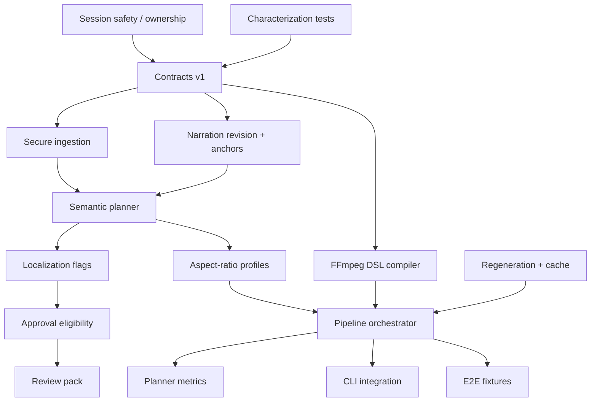

# Task Dependency Graph

## Parallelization notes

- Ingestion, contracts, and FFmpeg compiler were safe to implement in parallel.
- History-owned shared files were not modified; adapters remain Veronica-local.
