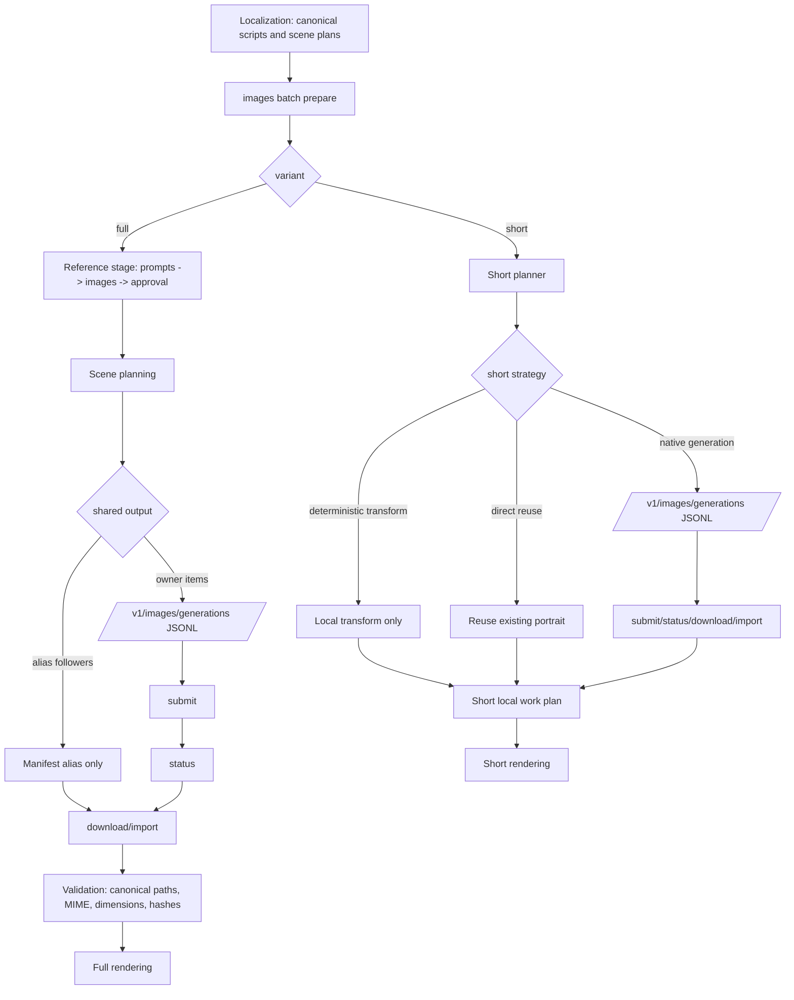

# CLI Batch Images

This document covers the implemented `images batch` workflow in the canonical CLI.
It is the local-first batch path for text-only image generation, short-image
native generation, and short-image local transforms. Reference-assisted batch
image edits are blocked pending manual provider verification.

Source of truth:

- CLI registration: `apps/cli/src/images-batch-commands.ts`
- Planner and staging: `packages/image-generation/src/image-batch-planner.ts`
- Submission, refresh, import, and resume: `packages/image-generation/src/image-batch-service.ts`
- Identity and path normalization: `packages/image-generation/src/image-batch-identity.ts`
- Resolver paths: `packages/shared/src/episode-filesystem.ts`

## Overview

`images batch` has five lifecycle commands:

- `prepare`
- `submit`
- `status`
- `download`
- `resume`

The workflow is local-first:

- `prepare` writes manifests and JSONL to the episode workspace and does not call
  OpenAI.
- `submit` uploads the prepared input file and creates the provider batch.
- `status` refreshes remote provider state into the local manifest.
- `download` imports finished outputs, validates them, and writes canonical files.
- `resume` prepares a retry batch only for retryable items.

## Support Matrix

| Command    | Network | Paid provider call | Writes local batch files | Uses provider client | Notes                                                         |
| ---------- | ------- | ------------------ | ------------------------ | -------------------- | ------------------------------------------------------------- |
| `prepare`  | No      | No                 | Yes                      | No                   | Builds local manifests, JSONL, and preview summaries.         |
| `submit`   | Yes     | Yes                | Yes                      | Yes                  | Uploads one prepared input file and creates the remote batch. |
| `status`   | Yes     | No                 | Yes                      | Yes                  | Refreshes remote status only.                                 |
| `download` | Yes     | No new paid work   | Yes                      | Yes                  | Imports completed results idempotently.                       |
| `resume`   | No      | No                 | Yes                      | No                   | Prepares a retry batch from retryable items only.             |

## Command Reference

### `images batch prepare`

Example:

```bash
pnpm mediaforge -- images batch prepare \
  --episode 001-demo \
  --languages en \
  --variants full \
  --json
```

Options:

- `--episode <episode-id>` required
- `--languages <comma-separated-languages>` default `en`
- `--variants <comma-separated-variants>` default `full`
- `--allow-unapproved-character-references`
- `--force`
- `--json`

Behavior:

- Reads runtime config and workspace root.
- Normalizes languages and variants.
- Accepts only one variant per run.
- Creates a deterministic local batch id per planned group.
- Writes `.batch` manifests, JSONL, and summary data under the episode state dir.
- Returns a JSON summary with episode, languages, variants, stages, local batch ids,
  endpoints, item counts, request settings, canonical paths, and alias follower
  counts.
- Short-variant JSON also includes `previewCounts` for paid native generations,
  local deterministic transforms, cache reuse, and blocked items, plus the
  `localWorkPlan` path.

`prepare` does not create a provider client and does not upload anything.

### `images batch submit`

Example:

```bash
pnpm mediaforge -- images batch submit \
  --episode 001-demo \
  --batch imgb-0f1a2b3c4d5e-p001-of001 \
  --json
```

Options:

- `--episode <episode-id>` required
- `--batch <id>` required
- `--json`

Behavior:

- Resolves the prepared manifest from the local batch id.
- Requires the manifest to still be in `prepared` state.
- Uploads the JSONL input file with Files API.
- Creates the provider batch with Batches API.
- Persists the remote batch id and input file id back to the manifest.

### `images batch status`

Example:

```bash
pnpm mediaforge -- images batch status \
  --episode 001-demo \
  --batch imgb-0f1a2b3c4d5e-p001-of001 \
  --json
```

Options:

- `--episode <episode-id>` required
- `--batch <id>` required
- `--json`

Behavior:

- Refreshes remote batch state only.
- Does not import images.
- Does not create a new batch.

### `images batch download`

Example:

```bash
pnpm mediaforge -- images batch download \
  --episode 001-demo \
  --batch imgb-0f1a2b3c4d5e-p001-of001 \
  --json
```

Options:

- `--episode <episode-id>` required
- `--batch <id>` required
- `--json`

Behavior:

- Refreshes remote state first.
- Imports only when the batch is terminal.
- Reconciles result and error lines by `custom_id`.
- Writes canonical assets atomically.
- Updates scene manifests, shorts manifests, or character registry entries when applicable.
- Returns `imported`, `imported_with_failures`, or `non_terminal`.

### `images batch resume`

Example:

```bash
pnpm mediaforge -- images batch resume \
  --episode 001-demo \
  --json
```

Example with an explicit batch reference:

```bash
pnpm mediaforge -- images batch resume \
  --episode 001-demo \
  --batch imgb-0f1a2b3c4d5e-p001-of001 \
  --json
```

Options:

- `--episode <episode-id>` required
- `--batch <id>` optional
- `--json`

Behavior:

- If `--batch` is omitted, the command uses the latest retryable image batch for
  the episode from the batch index.
- Prepares a new local retry batch only for retryable items.
- Preserves root and parent batch lineage.
- Does not submit or upload anything.

## Full Versus Short Strategy

### Full image batches

Full batches are the canonical scene-image path for full-video assets.

- They can prepare multiple languages in one run only when every colliding
  shared output is provably identical and can be represented as one owner item
  plus alias followers.
- They use a reference stage before scene planning.
- Scene batches currently submit only text-only generation requests.
- Shared output path: `shared/images/generated/`

Shared-output policy:

- The planner compares same-path multilingual candidates by provider request
  hash, generation configuration hash, operation, output format, and dependency
  hashes.
- If those fields match, one deterministic owner item keeps the provider request
  and the remaining items are manifest aliases that point at the same canonical
  output path.
- If those fields diverge, preparation fails before batch JSONL is written.
- `download` mirrors owner results into alias followers, and `resume` only
  resubmits owner items.

Reference stage semantics:

1. `reference-prompts` builds character reference prompts.
2. `reference-images` plans the reference image requests.
3. `reference-approval-validation` gates downstream scene batches.
4. `scene-prompts` prepares scene requests.
5. `scene-images` prepares generation or edit JSONL.

### Short image batches

Short batches are the canonical short-video image path.

- They also require one language per run because portrait outputs target shared
  canonical paths.
- They are planned from the short scene plan and short image strategy.
- Native portrait generation is the only short-image work that goes to the batch
  provider.
- Deterministic transforms and direct reuse stay local.
- Shared output path: `shared/short/images/generated/`

Short strategy outcomes:

- `native-generation` becomes provider JSONL.
- `deterministic-transform` is local-only and is written to the short local work
  plan, not to batch JSONL.
- `reuse` is local-only and reuses an existing portrait image.
- `blocked` stops preparation with a clear planner error.

## Lifecycle States

Manifest statuses:

- `prepared`
- `uploading`
- `submitted`
- `validating`
- `in_progress`
- `finalizing`
- `completed`
- `failed`
- `expired`
- `cancelling`
- `cancelled`
- `imported`
- `imported_with_failures`

Item statuses:

- `planned`
- `submitted`
- `api-succeeded`
- `api-failed`
- `expired`
- `policy-rejected`
- `decode-failed`
- `validation-failed`
- `persisted`
- `skipped-cached`
- `retry-required`

## JSONL Request Examples

The batch JSONL uses one request object per line.
The examples below are sanitized and match the implemented schema.

### Text-only generation

```json
{
  "custom_id": "dte-img:v2:001-demo:en:full:full-scene:generation:scene:scene-002:0123456789ab",
  "method": "POST",
  "url": "/v1/images/generations",
  "body": {
    "model": "gpt-image-2",
    "prompt": "A hallway lit by a single red lamp.",
    "n": 1,
    "size": "1920x1088",
    "quality": "medium",
    "output_format": "png"
  }
}
```

### Reference-assisted edit

There is no supported batch JSONL example for reference-assisted edits yet.
`images batch prepare` fails with `unsupported-edit-batch-request` and points to
the manual checklist in
`docs/plans/cli-batch-images/provider-reference-semantics-checklist.md`.

### Short native generation

Short native generation writes vertical shared portrait assets under
`shared/short/images/generated/`. Multi-language runs are allowed only when the
same scene can be represented as one owner request plus explicit alias followers.
The manifest records `sharedOutputKey`, `ownsSharedOutput`, and
`aliasedToCustomId` so `download`, `status`, and `resume` resolve aliases
deterministically without language collisions.

```json
{
  "custom_id": "dte-img:v2:001-demo:de:short:short-scene:generation:scene:scene-006:fedcba987654",
  "method": "POST",
  "url": "/v1/images/generations",
  "body": {
    "model": "gpt-image-2",
    "prompt": "A vertical portrait of the same moment, framed for short video.",
    "n": 1,
    "size": "1024x1536",
    "quality": "medium",
    "output_format": "png"
  }
}
```

### Deterministic short transform

There is no provider JSONL line for deterministic transforms.
Those entries stay in `state/image-generation/shorts-local-work.<language>.json`
for single-language runs or `state/image-generation/shorts-local-work.shared.json`
for multi-language runs, and are applied locally to produce the portrait asset.

## Sanitized v2 Manifest Examples

### Full-scene batch manifest excerpt

```json
{
  "schemaVersion": "image-batch-v2",
  "category": "image-generation",
  "localBatchId": "imgb-0f1a2b3c4d5e-p001-of001",
  "rootLocalBatchId": "imgb-0f1a2b3c4d5e-p001-of001",
  "retryNumber": 0,
  "createdAt": "2026-07-04T10:00:00.000Z",
  "updatedAt": "2026-07-04T10:00:00.000Z",
  "endpoint": "/v1/images/generations",
  "model": "gpt-image-2",
  "completionWindow": "24h",
  "inputFilePath": "episodes/001-demo/state/image-generation/.batch/inputs/batch-imgb-0f1a2b3c4d5e-p001-of001.jsonl",
  "inputFileHash": "sha256:example",
  "status": "prepared",
  "items": [
    {
      "customId": "dte-img:v2:001-demo:de:full:full-scene:generation:scene:scene-014:abcdef012345",
      "identity": {
        "schemaVersion": "image-asset-identity-v1",
        "episodeId": "001-demo",
        "language": "de",
        "variant": "full",
        "assetRole": "full-scene",
        "operation": "generation",
        "subject": { "kind": "scene", "id": "scene-014" },
        "promptHash": "abc123...",
        "model": "gpt-image-2",
        "size": "1920x1088",
        "quality": "medium",
        "dependencyHashes": [],
        "destination": {
          "root": "shared-images-generated",
          "relativePath": "shared/images/generated/scene-014__000000-000004__16x9.png"
        },
        "identityHash": "012345..."
      },
      "sharedOutputKey": "shared-output-key",
      "ownsSharedOutput": true,
      "requestedSize": "1920x1088",
      "quality": "medium",
      "outputFormat": "png",
      "status": "planned",
      "retryCount": 0
    }
  ]
}
```

### Short batch manifest excerpt

Short manifests use the same schema and item shape.
The only differences are the normalized language, `variant: "short"`, and the
`shared-short-images-generated` destination root.

## Identity And Dependency Rules

- `custom_id` is deterministic and includes the versioned identity prefix,
  episode id, language, variant, asset role, operation, subject kind, subject id,
  and a short identity hash suffix.
- Identity fields are normalized before hashing:
  - episode ids are lowercased
  - locale codes are normalized to canonical language codes
  - content variants are restricted to `full` or `short`
  - dependency hashes are de-duplicated and sorted
- `generation` maps to `/v1/images/generations`.
- `deterministic-transform` is not a provider-batch operation.
- Reference-assisted scene batches are blocked until manual provider verification
  proves `/v1/images/edits` JSONL semantics for image inputs.
- Missing reference images, stale dependency hashes, or unapproved references fail
  preparation unless the explicit override flag is set.
- Destination paths must resolve to canonical workspace-relative paths.
- Duplicate `custom_id` values are rejected.
- Duplicate destination paths are rejected unless every colliding item is part of
  one validated shared-output alias group.

## Canonical Output Paths

Batch preparation and import use these resolver-backed locations:

- Batch root: `episodes/<episode>/state/image-generation/.batch/`
- Batch inputs: `episodes/<episode>/state/image-generation/.batch/inputs/`
- Batch results: `episodes/<episode>/state/image-generation/.batch/results/`
- Batch errors: `episodes/<episode>/state/image-generation/.batch/errors/`
- Batch manifests: `episodes/<episode>/state/image-generation/.batch/manifests/`
- Batch reports: `episodes/<episode>/state/image-generation/.batch/reports/`
- Shared full images: `episodes/<episode>/shared/images/generated/`
- Shared short images: `episodes/<episode>/shared/short/images/generated/`
- Character references: `episodes/<episode>/shared/images/character-references/`
- Short manifest: `episodes/<episode>/shared/short/images/shorts-image-manifest.json`
- Short local work plan: `episodes/<episode>/state/image-generation/shorts-local-work.<language>.json`
  or `episodes/<episode>/state/image-generation/shorts-local-work.shared.json`

The import path resolver rejects manifest/filesystem disagreements instead of
writing to an unexpected destination.

## Deterministic Batch Splitting

- Request lines are sorted by deterministic `custom_id`.
- `maxRequestsPerBatch` splits request lines into fixed-size chunks.
- If the limit is unset, less than 1, or larger than the request count, the
  planner emits one group.
- Each group gets a deterministic local batch id derived from the group key,
  chunk index, chunk count, and request ids.
- Re-running the same inputs with the same settings produces the same local batch
  ids and manifest layout.

## End-To-End Flow

1. Canonical episode localization writes the scripts and scene plans that image
   planning consumes.
2. `images batch prepare` builds reference stages, scene stages, and short-image
   local work plans.
3. `submit` uploads the JSONL input file and creates the remote batch.
4. `status` refreshes the provider lifecycle state.
5. `download` imports completed results and reconciles them by `custom_id`.
6. `resume` prepares a new local batch for retryable items only.
7. Full-video rendering consumes `shared/images/generated/`.
8. Short-video rendering consumes `shared/short/images/generated/` and
   `shorts-image-manifest.json`.



## Validation And Recovery

- Invalid JSONL, schema errors, missing files, and hash mismatches fail before
  remote work is created.
- `submit` refuses already-submitted manifests.
- `status` and `download` accept either the local batch id or the OpenAI batch id
  once a batch has been submitted.
- `download` marks unknown or duplicate `custom_id` lines, stale dependencies,
  invalid base64, invalid MIME, invalid dimensions, and destination conflicts as
  recovery or validation failures.
- `download` is idempotent after a successful import.
- `resume` only includes retryable owner items and preserves lineage across
  retries.
- If no retryable items remain, `resume` fails instead of creating a duplicate
  paid batch.

## Observability

Machine-readable command output includes:

- episode
- languages
- variants
- stages
- local batch ids
- provider batch id, when present
- endpoint list
- item counts
- alias follower counts
- request model, size, and quality
- command status and provider status
- unknown and duplicate result counts
- canonical path bundle
- short `previewCounts` and `localWorkPlan`, when `--variants short`

Import reports also record:

- total items
- failed item count
- retryable item count
- unknown result count
- duplicate result count
- persisted files
- unknown and duplicate custom ids

## Security And Cost Controls

- `prepare` and `resume` are local-only and do not create paid work.
- `submit` is the only command that uploads a JSONL file and creates a batch.
- `download` only imports terminal results.
- `status` reads remote state but does not import or submit.
- `prepare` uses local request summaries so operators can inspect model, size, and
  quality before any provider call.
- Deterministic short transforms and direct reuse remain local so short batches do
  not pay for work that can be derived safely.
- Reference-assisted batch edits remain manual-only and are not provider-safe in
  normal `prepare`.
- Logs and summaries exclude secrets, signed URLs, and raw provider credentials.

## Tests

Focused coverage exists in:

- `apps/cli/src/images-batch-commands.unit.test.ts`
- `apps/cli/src/images-resume-command.unit.test.ts`
- `packages/image-generation/src/image-batch-planner.unit.test.ts`
- `packages/image-generation/src/image-batch-service.unit.test.ts`

Useful smoke checks:

- `pnpm test:focused -- apps/cli/src/images-batch-commands.unit.test.ts`
- `pnpm test:focused -- packages/image-generation/src/image-batch-planner.unit.test.ts`
- `pnpm test:focused -- packages/image-generation/src/image-batch-service.unit.test.ts`
- `pnpm docs:diagrams:check`

## Troubleshooting

- `--episode is required`: pass the episode id explicitly.
- `Unsupported image batch variant selection`: use exactly one of `full` or
  `short`.
- `Missing localized full script` or `Missing localized short script`: create the
  relevant localized script before running `prepare`.
- `Missing canonical scene plan`: the episode needs a canonical scene plan before
  full-image preparation.
- `Missing reference image` or `Character ... requires an approved reference`:
  generate or approve the reference before planning the dependent scene.
- `unsupported-edit-batch-request`: stop and use the manual checklist instead of
  attempting a paid provider verification from the normal CLI flow.
- `Image batch ... was already submitted`: use the existing remote batch id for
  `status` or `download` instead of resubmitting.
- `Image batch ... has no retryable items`: the batch lineage is already clean.
- `Manifest/filesystem disagreement`: fix the canonical path inputs before
  importing again.

## Known Limitations

- Multilingual preparation only works when colliding outputs can be represented
  as safe aliases. Full scenes compare complete provider request semantics;
  short shared portraits require explicit same-scene short aliases.
- Deterministic short transforms stay local and never become provider JSONL.
- Reference-assisted batch edits are blocked pending manual provider
  verification.
