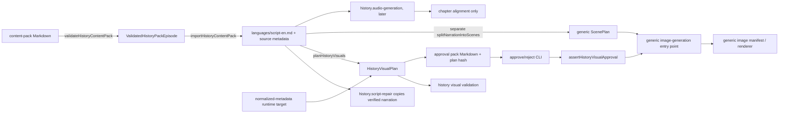

# History visual planner: current state and reproduction

Status: analysis only. Evidence was collected on 2026-08-05 from the checked-out workspace; no episode artifact was written or approved.

## Scope and evidence status

The History visual planner and its test are currently uncommitted workspace files. They are analysed as the code that produced the supplied artifact, not treated as a stable repository contract. Existing unrelated worktree changes were not altered.

Facts below are source-backed. `Inference` identifies a conclusion drawn from source plus artifact evidence; `Unresolved` identifies a seam that cannot be proven without historical artifact lineage that is not stored.

## End-to-end flow

| Stage | Owner / types | Persisted artifacts | Determinism, cache, validation, fallback |
| --- | --- | --- | --- |
| Pack → narration | `packages/history/src/content-pack.ts`: `validateHistoryContentPack`, `importHistoryContentPack`; `ValidatedHistoryPackEpisode`, `NormalizedHistoryMetadata` | `languages/script-en.md`, `source/normalized-metadata.json`, editorial/research/provenance JSON | deterministic; import source hash avoids re-import, but the persisted script has no hash/lineage check after import. Structural pack validation only. |
| Script repair / research | `packages/history/src/task-registry.ts`; `packages/history/src/research.ts`, `validation.ts` | verified narration, claims, chronology, factuality audit when workflow runs | workflow tasks; factual validator is narration/claim focused, not visual-plan focused. |
| Visual plan | `packages/history/src/visual-planner.ts`: `buildHistoryVisualPlan`, `planHistoryVisuals`; `HistoryVisualPlan`, `HistoryVisualBeat`, `HistoryAssetSpec` | `source/history-visual-plan.json`, shot list, asset draft manifest | deterministic; target runtime is metadata if present, otherwise WPM estimate. Cache is only equality with the previous plan hash. |
| History approval pack | `renderApprovalPack`, `HistoryApprovalPack` | `source/history-approval-pack.md`, `history-visual-approval.json`, validation JSON | deterministic Markdown projection; approval binds only plan hash. |
| Generic scene plan | `task-registry.ts`: `splitNarrationIntoScenes`, `history.visual-planning` implementation; domain `ScenePlan` | `shared/scenes.json`, `canonical/scenes.json`, `manifest.scenePlan` | second, unrelated deterministic 16-scene plan; its durations are an independent WPM estimate. |
| Audio / timing | `history.audio-generation`, `history.chapter-alignment` | expected narration WAV; final chapters | audio is downstream of History visual planning. No measured audio or alignment enters the History plan. A missing metadata file falls back to WPM. |
| Images/render | History task calls `assertHistoryVisualApproval`, then generic image command; `packages/image-generation`, `packages/rendering` | generic image and render manifests | approval is a gate, but no typed History-plan-to-generic-scene mapping is present. Shared renderer supports `ShotPlan` and 16:9/9:16, but History does not feed it. |

## Failing artifact reproduction (read-only)

The supplied artifact is at `episodes/history-youtube-history-10-video-story-pack-02-napoleons-invasion-of-russia/source/`. The following read-only procedure reproduced the observations without calling a provider or writing episode state:

1. Read `languages/script-en.md`, `history-visual-plan.json`, `history-visual-validation.json`, and `history-approval-pack.md`.
2. Normalize the script exactly as `normalizeWhitespace` does; compare its SHA-256 and character length with `scriptHash` and the final beat range.
3. Count media types in `assets` and `beats`, compare with `strategy.mediaMix`, and calculate the duration distribution.
4. Inspect `buildHistoryVisualPlan`, `sentenceChunks`, `validateHistoryVisualPlan`, and the workflow visual-planning binding.

Observed result: normalized source length is 9,506; `scriptHash` matches; beat 1 starts at 0 and beat 63 ends at 9,506. The source narration therefore survives into the persisted History plan. Beat 63 spans 2,168 characters, including the complete conclusion, but receives 9.52 seconds. The approval pack's apparent cut-off at `langu…` comes from `visualPurpose` using `chunk.text.slice(0, 120)`, not a sliced narration range. Asset prompts similarly use a 220-character display/prompt slice.

The source pack declares and its importer counted 1,076 words, while the persisted script has 1,410 words. The importer writes the extracted narration directly, yet the current script differs materially from the checked-in pack. This is a confirmed integrity discrepancy, but the first mutation is **unresolved**: artifacts retain the pack hash but no post-import script hash, event payload, or revision links the current script to a transformation.

## Confirmed algorithms and defects

### Timing and segmentation

`buildHistoryVisualPlan` reads `metadata.runtime.targetDurationMinutes` (10) ahead of audio. It derives an edited-shot target (63 at 10 minutes), calls `sentenceChunks(narration, 63)`, then computes `secondsPerBeat = runtime * 60 / chunks.length`. Each beat start/end is independently rounded to two decimals. This precisely explains 62 durations of 9.52s and one of 9.53s and total 600s.

`sentenceChunks` preserves sentence matches but stops flushing once `output.length` reaches `target - 1`; every remaining sentence accumulates into `current`. Consequently, the target controls the final semantic beat's size. It does not intentionally drop source text, but it creates a severely unrenderable final interval and can hide that fact through the excerpt.

No audio exists for this episode. At 1,410 words in 600 seconds, the implied delivery is 141 WPM, inconsistent with metadata's stated 104–112 WPM and with the planner default of 108 WPM. This confirms invalid timing reconciliation, not audio truncation.

### Validation false negative

`validateHistoryVisualPlan` declares coverage when first start is zero and every beat starts at the prior beat's end. It does **not** check that the last narration end equals source length, that every interval ends on a semantic boundary, beat text length versus duration, timeline monotonicity, source hash versus current text, audio duration, actual media mix, aspect coverage, source evidence, or downstream scene equivalence. It only errors for the start/adjacency condition and missing map/diagram beats; duplicate full asset prompts and static intervals over twelve seconds are warnings. The final 9.52-second beat is below the static threshold; all generated full prompts are distinct; warnings therefore correctly aggregate to none under this insufficient contract.

### Allocation and directions

The reported strategy quota is calculated from an asset target, but selection ignores it. `assetMedia` is the literal cycle `cinematic-scene, archival, cinematic-scene, map, cinematic-scene, diagram`; assets use `index % assetMedia.length`; beats use `index % assets.length`. The artifact actually has 20/7/7/6 assets and 32/11/11/9 beats, while the pack reports the unused target 26/5/4/5. This is a confirmed quota-reporting correctness defect as well as mechanical editorial allocation.

`visualPurpose`, generic asset title, constant factual constraints, fixed confidence (0.74), and stock motion strings are produced locally. No History visual LLM prompt or enrichment path participates. The plan asks neither for composition/camera/source reference nor per-ratio design. Existing History research contracts can hold claims and sources, but no visual beat links to them.

### Maps, diagrams, aspect ratio, and identity

The taxonomy has only cinematic scene, map, diagram, archival. Every map/diagram asset is independent despite a `reusable` boolean; `HistoryMapSpec` has extent/routes/labels and `animated`, with no master/state/time/frame/legend/camera relation. Archival records subject/date but lack source IDs, rights, URI, credibility or claim linkage. The History plan has no ratio field. The separately generated `Scene` hard-codes `aspectRatios: ["16:9"]` and landscape composition.

`assets.length` is currently a generated specification count; `beats.length` is also written as one `HistoryShotSpec` per beat. That makes "edited shots" a synonym for beats and not a rendering concept. Asset reuse is both under-specified and unstable: the asset choice for a beat is modulo arithmetic, while no asset variant/crop/map-state/render identity exists.

## Cross-genre and downstream blast radius

The findings are confined to the new History-specific planner until its artifacts are wired into shared pipelines. Dark Truth has separate post-audio `retimeScenePlan`; math has its own educational pipeline; VeronicaBenini / generic auto-genre do not call this History module. Shared `packages/domain`, `visual-planning`, `image-generation`, and `rendering` already contain additive `Scene`, `ShotPlan`, focal, evidence, aspect and FFmpeg facilities. Reusing them prematurely would affect their existing hash and renderer contracts.

The highest immediate risk is the double-plan boundary: only generic `ScenePlan` is consumed by generic image generation, while approval covers the disconnected History plan. A History redesign must bridge these with an explicit versioned adapter and characterization fixtures, rather than changing shared defaults. Existing approved plans must remain parseable as legacy and never be silently reinterpreted.

## Observability today

Plan JSON records only a hash, strategy, beats, assets, and a small validation report. The Markdown pack surfaces requested target mix, not observed mix. No structured diagnostics record source/planned units, audio delta, fallback, timing distribution, selection reason, map state, ratio coverage, cache key inputs, or validation severity totals.
