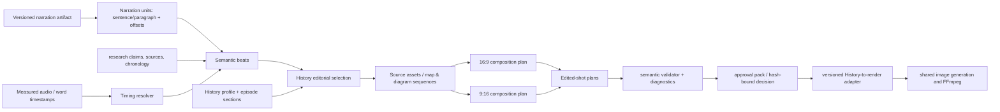
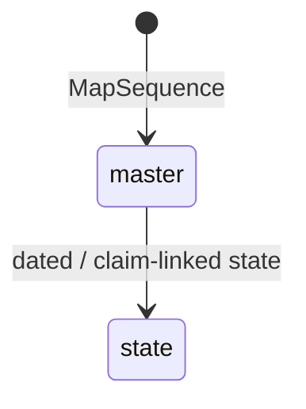

# Target design (approval required before implementation)

## Design principles

Keep History policy in `@mediaforge/history`; reuse shared scene/shot rendering primitives only through an additive, versioned adapter. The source narration is immutable input for a planning revision. A target duration is a production constraint, never permission to remove words or split a sentence silently.



## Domain ownership and concepts

| Concept | Meaning and immutable owner |
| --- | --- |
| Narration artifact | exact normalized source text, source revision/hash, locale and units; History import/script-repair owns it. |
| Narration unit | source sentence/paragraph offsets and text hash; sentence boundaries may be grouped but never altered by a visual planner. |
| Semantic beat | editorial claim or narrative purpose connected to contiguous narration-unit IDs; History owns semantic interpretation, section/importance and required evidence. |
| Source asset | reusable image, document, portrait, terrain, material-culture source, reconstruction brief, map master, or diagram master. It is not a shot. |
| Map/diagram state | an immutable dated/ordered state of a reusable sequence, with facts, labels, legend and camera intent. |
| Composition variant | a ratio-specific layout/focal/safe-zone strategy for a source asset/state. |
| Edited shot | a timed use of an asset/composition/state, with transition/overlay; it must reference narration or have an explicit non-narrated purpose. Shared `RenderShot` is the eventual renderer representation. |

Beat boundaries become immutable after the timing resolver and semantic segmentation validator accept them. Later asset choice and composition may not re-segment narration; a revision creates a new plan.

## Proposed History contract shape

Do not copy this verbatim into shared domain. First add it under a History schema version, then map its renderable subset into current shared `ScenePlan` / `ShotPlan` contracts.

```ts
type TimingSource =
  | { kind: "measured-word-timestamps"; audioHash: Sha256 }
  | { kind: "measured-audio-proportional"; audioHash: Sha256 }
  | { kind: "estimated-sentence"; wordsPerMinute: number };

interface NarrationUnit {
  id: NarrationUnitId;
  start: CharacterRange; end: CharacterRange;
  textHash: Sha256; kind: "sentence" | "paragraph";
  timing: { startMs: number; endMs: number; source: TimingSource };
}
interface HistoryBeat {
  id: BeatId; narrationUnitIds: NarrationUnitId[];
  sectionId?: string; role: "hook" | "setup" | "evidence" | "turn" | "climax" | "aftermath" | "conclusion";
  importance: 1 | 2 | 3 | 4 | 5;
  visualPurpose: string; claimIds: ClaimId[];
  hardRequirements: readonly VisualRequirement[];
}
interface SelectedVisual {
  selectionReason: SelectionReason; media: HistoryMedia;
  constraints: HistoricalConstraint[]; provenance: ProvenanceLink[];
  confidence: ConfidenceAssessment;
}
interface CompositionVariant {
  ratio: "16:9" | "9:16"; strategy: "native" | "recompose" | "crop" | "split-panel";
  focalRegions: FocalRegion[]; textSafeZones: SafeZone[]; layout?: MapLayout;
}
```

`HistoryMedia` should initially remain a discriminated union: `reconstruction`, `archival`, `document`, `portrait`, `material-culture`, `terrain`, `map-state`, `diagram-state`, `quotation`, and `editorial-text`. The profile exposes eligibility and soft target ranges by episode/section; it must model `unavailable` rather than fabricate a source. It should not hard-code Napoleon rules.

`HistoricalConstraint` is claim-derived where possible: date/range, place, actor/army, season/weather, uniforms/insignia, weapons/transport, terrain/architecture, exclusions, uncertainty disclosure, and source references. Cinematic reconstruction requires a non-empty constraint set and an explicit “illustrative reconstruction” classification; it is never provenance for a historical claim. Provenance records source ID, locator/URI where available, rights status, confidence, and claim IDs.

## Timing and segmentation strategy

1. Prefer measured word/sentence timestamps from final narration audio.
2. Otherwise use measured total audio duration and distribute sentence estimates proportionally, preserving whole units; emit `TIMING_MEASURED_AUDIO_NO_WORDS`.
3. Otherwise estimate sentence durations from words/punctuation and profile WPM; emit a warning diagnostic and mark the plan provisional.

The resolver computes in integer milliseconds. It preserves source units and reconciles only within a declared tolerance (recommended: ±250ms with measured duration; ±1% for estimation). If the target duration conflicts with complete narration, planning reports `NARRATION_DURATION_CONFLICT`; the operator must revise narration or target, not clip text. Variable beat/shot pacing derives from unit durations, role/importance and allowed visual cuts. A bounded final reconciliation adjustment is spread only across eligible holds/transitions, never across text intervals beyond tolerance.

## Editorial selection and reusable sequences

Selection has four deterministic layers: (1) hard requirements from claims/sections, (2) eligible candidates with evidence availability, (3) score based on visual purpose, role, novelty, source authority and ratio feasibility, and (4) a constrained repair that may satisfy soft media-mix goals but cannot replace hard semantic choices. Persist the candidate decision reason and rejected hard conflicts. An optional LLM may propose enriched, schema-validated briefs; deterministic rules validate and choose policy compliance.



A `MapSequence` has master geography/projection/source disclosure; each `MapState` adds effective time, army positions/routes/supply/depot/depletion data, labels, legend, strategic/tactical scale, camera and claim IDs. A diagram sequence uses the same master/state pattern. The Napoleon example can be represented as one campaign sequence with states for coalition context, Niemen crossing, divided armies, Smolensk, Borodino/Moscow, south-west attempt, devastated retreat, Berezina threat, and exit—without making those states generic mandatory templates.

## Ratio, adapter, validation, and approval

Semantic beats and source assets are ratio-neutral. Every required delivery ratio gets an independently authored `CompositionVariant`: native generation where appropriate, deterministic crop only with a focal/crop-safe proof, portrait stack/split-panel for maps/diagrams, and independent text-safe zones/label priority. The History adapter compiles approved composition and edited-shot variants into the existing shared render contracts. It fails if its source History plan hash/schema/version does not match the approved decision.

Validation is layered:

| Layer | Blocking errors | Warnings |
| --- | --- | --- |
| integrity | source hash/range mismatch, incomplete coverage, invalid final semantic boundary | estimate-only timing |
| timing | non-monotonic/overlap, duration beyond tolerance, missing required audio variant | duration distribution advisory |
| editorial | hard requirement unsatisfied, cinematic constraints absent, required provenance/rights absent | soft mix deviation, repetition risk |
| composition | missing required ratio, unsafe/corrupt crop/map label collision | low-confidence focal layout |
| pipeline | stale adapter/plan hash, missing downstream derivative | cache miss/fallback used |

Approval eligibility is true only with no blocking errors. The approval pack is a projection of the typed artifact and reports coverage/delta, timing distribution, targets versus actual mix, selection reasons, map/diagram state/reuse, source/rights/confidence summaries, both ratio coverages, chapter/anchor outline, and plan/schema/planner/adapter versions. It must show a full linked narration range or safe excerpt plus unit count—not a lossy snippet presented as the beat.

## Versioning, compatibility, observability

Introduce `history-visual-plan.v2` rather than changing v1 parsing. A legacy reader marks v1 plans `legacy-unrenderable-under-v2` for new History execution unless explicitly approved under its original version; it never recomputes meanings. Retain v1 artifacts, hashes, and approvals. New cache keys include narration artifact hash, unit boundaries/timing source, profile policy, claim/source inputs, selection result, sequence states, required ratios/compositions, validation policy, schema/planner/adapter versions. Rights/source fetching state is referenced by immutable manifest hashes, not included as mutable filesystem paths.

Write per-episode structured diagnostics/artifacts (not Prometheus labels) for `sourceNarrationCharacters`, `plannedNarrationCharacters`, unit coverage/ranges, measured/estimated/planned duration, delta, duration distributions, transitions/run lengths/reasons, asset reuse, map/diagram states, ratio coverage, errors/warnings, versions/hash/cache hit and fallbacks. Aggregate metrics may use low-cardinality planner/version/profile/outcome labels only.
