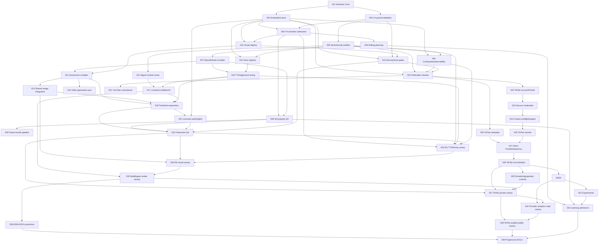

# Vertical Microdrama Factory implementation plan

Date: 2026-08-12
Status: ACTIVE
Backlog: `docs/tasks/microdrama/implementation-backlog.json`

## Objective and execution rule

Implement a provider-independent serialized microdrama system using one typed
narrative canon, embedded structured persistence, hash-addressed large artifacts,
locale-specific production projections, and approval-gated provider effects.

Execute exactly one READY backlog task at a time. A task becomes DONE only when
its scope and acceptance criteria are complete, focused validation passes, the
required report exists, and no blocker remains. Architecture conflicts block the
task until an ADR/plan amendment and backlog update are approved.

## Invariants

- No PostgreSQL requirement or Prisma for new microdrama state.
- Reuse the existing workflow engine; do not add a second workflow engine.
- Narrative Core has no persistence, provider, media, publication, or analytics I/O.
- Large artifacts stay outside SQLite and are referenced by immutable hashes.
- V4 is one 100-episode canon with 400 supplied locale ScriptRevisions.
- Selected locale audio and alignment determine final production timing.
- Shared visual semantics/assets are the default across locales.
- Provider calls, paid calls, and publication calls require task-specific policy
  and explicit operator authorization; backlog eligibility is not authorization.
- TikTok uses official APIs only and ambiguous effects reconcile instead of
  blindly retrying.
- `STORY_APPROVED`, `ASSET_GENERATION_APPROVED`, and `PUBLICATION_APPROVED`
  bind exact revisions and cannot be bypassed by force/retry/resume.
- Untrusted source/provider payloads cannot alter canon, tools, providers,
  accounts, policy, or approval. Artifact MIME/hash/URL and redaction gates fail
  closed.

## Implementation DAG

## Phase boundaries

| Phase | Tasks | Outcome | Calls by default |
|---|---|---|---|
| 01 Narrative foundation | MICRO-001 | Pure IDs, schemas, revisions, canon validators | Local only |
| 02 Embedded state and V4 admission | MICRO-002–005 | Durable embedded authority and admitted V4 corpus/profile | Local only |
| 03 Story planning and QA | MICRO-006–009 | Rolling plans, episode/beat compilation, canon/parity gates | Local/mocked |
| 04 Media planning and production | MICRO-010–019, 040–041, 043 | Registries, security, cost controls, semantic shots, locale audio/timing, rights, composition, QA | Local/mocked until canaries |
| 05 Publication | MICRO-020–029 | Provider-specific durable publication, TikTok official API architecture | Local/mocked |
| 06 Performance and learning | MICRO-030–032 | Revision-linked observations, experiments, canon-safe recommendations | Local/mocked |
| 07 Bounded canaries | MICRO-033–039, 042 | Explicitly authorized staged production/publication and analytics reads | Side effects only per task approval |

## Phase requirements

### 01 — Narrative Core

Create `@mediaforge/narrative-core` with branded IDs, runtime schemas, revision
envelope/state, SeriesBible, Character/CharacterState, directional relationships,
secrets, knowledge, promises, snapshots, and deterministic validators. Keep it
generic: no `7 MINUTES AHEAD`, WPM, locales, Signal, providers, persistence, or I/O.

### 02 — Embedded state and V4 admission

Add SQLite repositories and migrations for narrative/import/profile state behind
ports. Build a fail-closed V4 parser/hash validator, then compile shared canon
evidence and 400 imported script revisions into one 100-episode identity graph.
Persist BCP-47 locale profiles and separate lexical/audio timing policies. Media
generation is out of scope.

### 03 — Story planning and QA

Add season, arc, near-horizon, EpisodeSpec, BeatPlan, and revision workflows over
accepted snapshots. Deterministic QA owns chronology, knowledge, promise, reveal,
boundary, hook, and localization-parity rules. Future-locale generation remains
after V4 admission and cannot modify supplied revisions.

### 04 — Media planning and production

Add reusable character/location/prop/voice registries; typed Signal UI and
platform safe zones; language-neutral Beat/Scene/Shot identity; shared-visual
cache policy; provider ports; selected-audio measurement/alignment; independent
locale subtitles/UI; typed timeline/composition; and production QA. Provider
integration tasks use mocks until an explicitly authorized canary.

Before canaries, add revision-linked cost/quota attribution and bounded
observability, untrusted-input/artifact trust gates, and separate
licensed/imported ambience/SFX/music tracks with rights evidence. Generated
music remains deferred.

### 05 — Publication

Persist provider-specific intents/effects in the embedded store. Retain YouTube
as a distinct projection. Split TikTok into account/OAuth, secure credential
handles, creator preflight, locale target mappings, metadata, FILE_UPLOAD default
with constrained PULL_FROM_URL, Direct Post, idempotency, reconciliation, and
scheduling/operator controls. Capability remains disabled outside canaries.
Schedule records never authorize unattended or public-API dispatch; initiation
remains operator-controlled under ADR-OPERATIONS-001.
Persist provider correlation IDs and rate-limit/`Retry-After` state; the single
retry owner pauses safely and never converts throttling or ambiguity into a
duplicate mutation.

### 06 — Performance and learning

Ingest immutable provider/account/locale/revision/window observations, normalize
with versioned null-aware definitions, and support controlled experiment records.
Learning produces recommendations only; canon-aware validation and acceptance
are mandatory before future planning consumes them.
Provider adapters and storage are implemented with fixtures first; a separate,
explicitly authorized read-only canary proves live observation ingestion before
any audited public TikTok canary.

### 07 — Bounded rollout

Run separate EN E001–E003 audio/timing and visual canaries, then a shared-visual
DE/ES/PT-BR render canary, then E004–E010. TikTok private and audited public
canaries are separate tasks. E011+ stays blocked until production, publication,
analytics, and learning gates have evidence. No canary task title grants provider
authorization.

## Task status and reporting

- Only MICRO-001 is initially READY because Narrative Core does not exist and
  requires no unresolved implementation dependency.
- Every other task is BLOCKED until all `dependsOn` tasks are DONE and any
  explicit side-effect approval is recorded.
- No task begins IN_PROGRESS through planning alone.
- Required task validation is focused and bounded by repository guardrails.
- Every modifying task creates a concise Codex run report. Work based on this
  plan additionally creates or updates the dated implementation report required
  by `AGENTS.md`.

## Recovery and rollback

Prefer additive packages, migrations, adapters, and capability flags. Disable
task registration/provider capability before rollback; never delete accepted
revisions or immutable provenance. Embedded migrations require backup and
forward-repair procedures. Provider ambiguity is reconciled, not rolled back by
issuing another effect.
