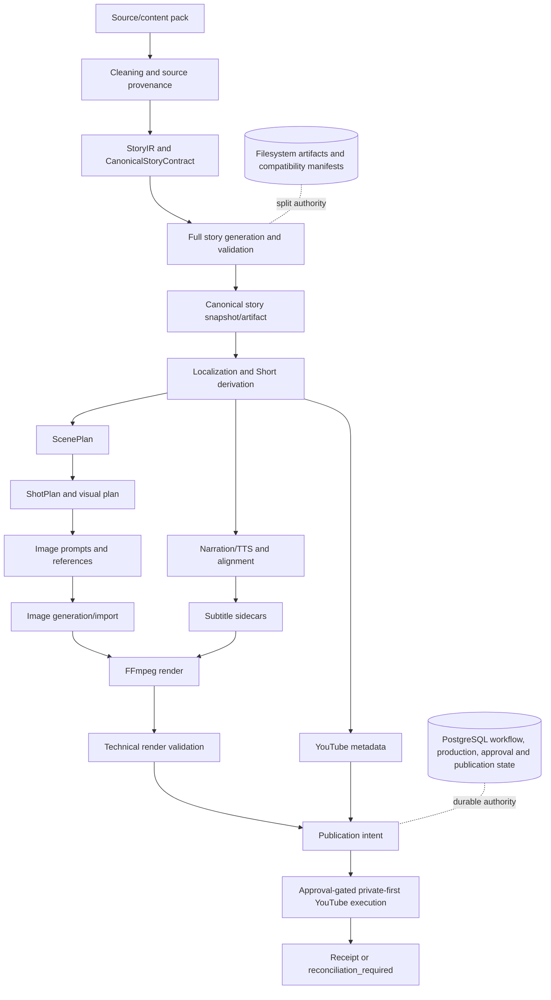
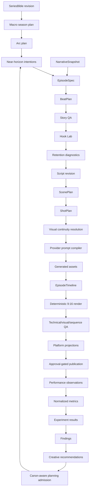
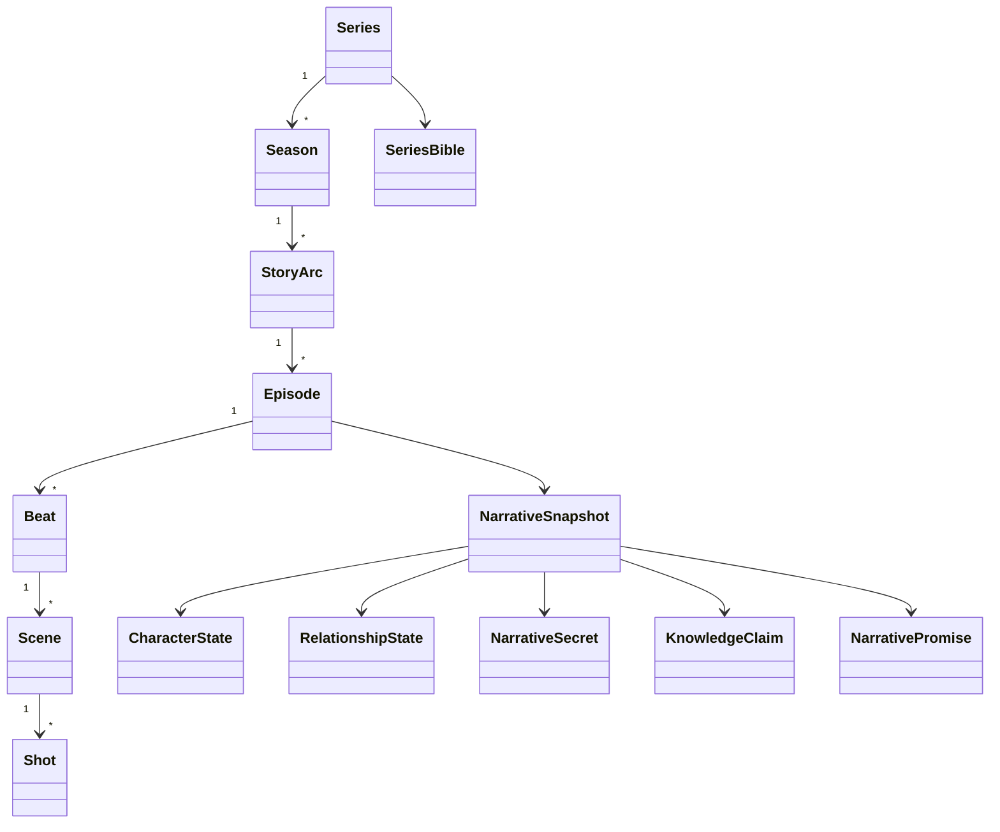
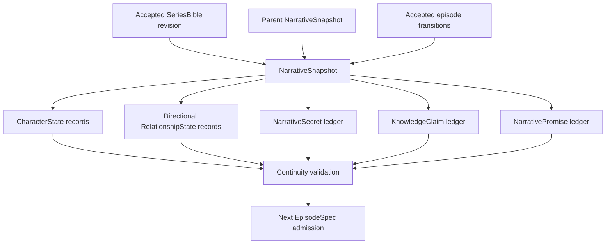
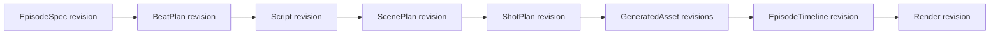
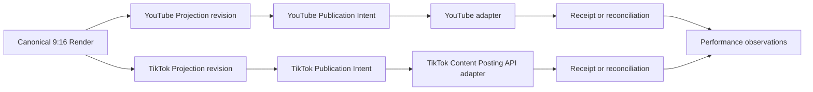
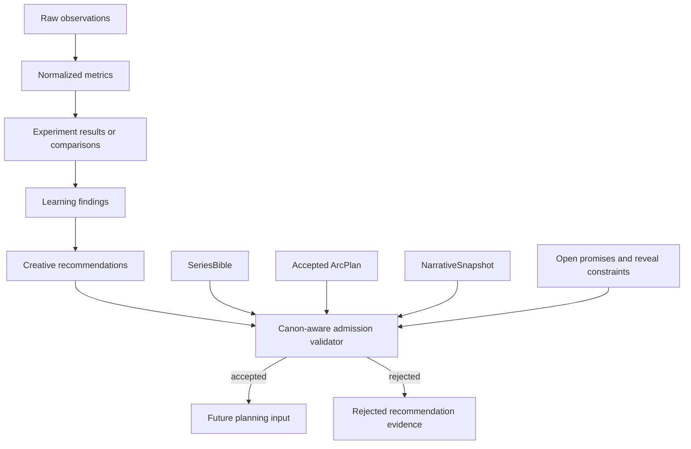
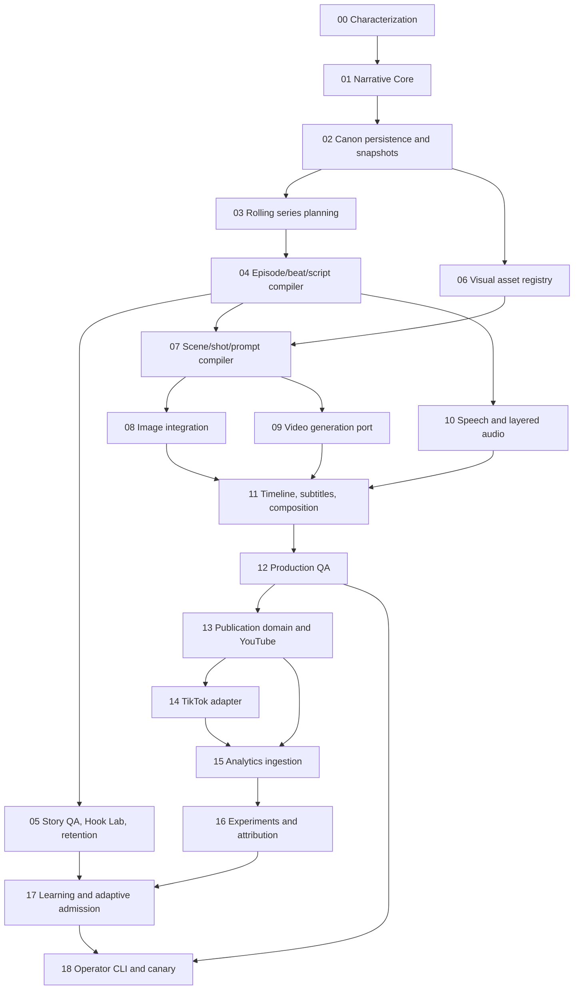

# Phase 00 — Vertical Microdrama Factory Architecture

Date: 2026-08-12
Status: SUPERSEDED IN PART
Baseline: feature/tiktok-integration at e28e10ca77a4e2d33093c8b53e30bdcbc8e8877a

> **Supersession notice:** Repository observations and the provider-independent
> narrative/media analysis remain useful. The PostgreSQL microdrama direction,
> the generic 60–90 second assumption for `7 MINUTES AHEAD`, and the high-level
> TikTok phase are superseded by the active microdrama index, ADRs, Phase 00B,
> and Phase 00C-V4. This document is historical characterization, not the
> current implementation authority.

## A. Executive summary

The repository can evolve into a production-grade Vertical Microdrama Factory without replacing its production foundations.

Major reusable systems are the Zod contracts, branded IDs, production revisions, approvals, artifact lineage, PostgreSQL jobs, leases, fencing, outbox effects, reconciliation, quotas, audit records, structured story generation, localization, Short derivation, semantic QA, caching, scene and shot planning, image generation, speech, FFmpeg rendering, YouTube publication safety, and immutable analytics observations.

The blocking gaps are:

- No authoritative serialized narrative state spanning a series.
- No series/season/arc hierarchy, canon ledger, narrative snapshot, narrative promises, secret/knowledge model, or directional relationship state.
- No typed EpisodeSpec or dramatic BeatPlan governing state transitions.
- No canon-protected analytics-to-planning admission boundary.

The target adds pure @mediaforge/narrative-core and orchestration-focused @mediaforge/microdrama packages while extending existing story, workflow, persistence, media, publication, observability, and cost infrastructure. PostgreSQL database-v1 state becomes authoritative for microdrama. Prompts, prose, media, Markdown, and directory layouts remain derived artifacts.

Required approval gates are STORY_APPROVED, ASSET_GENERATION_APPROVED, and PUBLICATION_APPROVED.

Recommended ADRs:

1. ADR-MICRODRAMA-001: structured narrative state and immutable revisions.
2. ADR-MICRODRAMA-002: rolling planning and canon-protected learning.
3. ADR-MICRODRAMA-003: reuse durable workflow and side-effect safety.
4. ADR-MICRODRAMA-004: series asset registry and typed timeline.
5. ADR-MICRODRAMA-005: provider-specific publication adapters.

## B. Current repository architecture

| Area | Current owner |
|---|---|
| Operator surface | apps/cli |
| API, durable workers, reconciliation | apps/api |
| Shared production/workflow contracts | packages/domain |
| Durable task graph, cache, attempts | packages/workflow-engine |
| PostgreSQL, RLS, jobs, effects, publications | packages/persistence |
| Story rewrite/localization/Shorts | packages/story-localization |
| Scene and shot planning | packages/scene-planning, packages/visual-planning |
| Image generation and references | packages/image-generation, packages/dark-truth |
| Speech/TTS | packages/speech |
| Composition and FFmpeg | packages/rendering, packages/veronica-media |
| Metadata and YouTube | packages/metadata, packages/youtube-upload |
| Logging, costs, recovery telemetry | packages/observability |
| Episode workspaces | packages/shared/src/episode-filesystem.ts |
| Legacy workflow authority | Episode state files, manifests, SQLite compatibility |
| Modern production authority | PostgreSQL database-v1 repositories |

No Prisma, RabbitMQ, Temporal, Redis/BullMQ, YugabyteDB, or deployed MinIO stack was found. PostgreSQL durable dispatch and the outbox satisfy present scale requirements; do not add a broker.

## C. Existing pipeline



Representative paths:

- Story flow: apps/cli/src/story-localization-commands.ts to packages/story-localization/src/story-localization.service.ts.
- Story contracts: story-artifact-model.ts, canonical-story-contract.ts, and canonical-full-story.persistence.ts.
- Direct episode flow: apps/cli/src/episode-commands.ts to packages/dark-truth/src/index.ts.
- Disciplined render flow: apps/cli/src/story-render-command.ts to packages/rendering/src/index.ts.
- Modern publication: packages/application/src/publication-execution.ts and its API/persistence composition.
- Analytics baseline: packages/domain/src/revision-analytics-comparison.ts and packages/persistence/src/postgres-revision-analytics-repository.ts.

Current content-domain answers:

| Question | Finding |
|---|---|
| Canonical episode model | Operational episode/production models exist; serialized narrative episode does not |
| Typed | Yes, extensively Zod-backed |
| Persisted | Yes, but story payloads remain partly filesystem-backed |
| Revisioned | Production and canonical story revisions exist |
| Narrative state | Source facts and per-story contracts only |
| Media state | Scene, shot, asset, render, and production state exist |
| Content/artifact identity | Mostly separate; legacy path-backed coupling remains |
| Locale/platform identity | Separate |
| Publication identity | Separate and durable |

Existing concept mapping:

| Current concept | Current location/semantics | Future role | Decision |
|---|---|---|---|
| EpisodeId | packages/domain; slug-shaped production identity | Referenced by narrative episode | Reuse; do not overload |
| StoryIR | story-artifact-model.ts; one source adaptation | Optional narrative import | Reuse as adapter input |
| CanonicalStoryContract | Per-source characters/events/locations | Seed an episode draft | Adapt, never canon |
| CanonicalStorySnapshot | One story artifact revision/hash lineage | Pattern for narrative revisions | Reuse pattern |
| Legacy StoryBible | Per-episode production artifact | Compatibility report | Not authoritative |
| RetentionBeat/source beats | Extraction and Short-selection heuristics | Dramatic beat inputs | Extend |
| ScenePlan | Timed narration-driven scenes | Derived from accepted beats/scripts | Extend |
| ShotPlan | Deterministic pacing/treatments | Derived microdrama shot plan | Extend |
| ProductionRevision | Episode/locale/variant/config binding | Accepted production envelope | Reuse |
| ArtifactContract | Hashes, lineage, locale, variant | All derived artifacts | Reuse |
| Publication intent | Approval/account/artifact binding | Provider-neutral domain | Extend |
| Analytics observation | Immutable non-mutating observation | Performance input | Extend |

## D. Reuse matrix

| Capability | Current implementation | Reuse? | Required change | Risk |
|---|---|---:|---|---|
| Text generation | Story localization Responses API | Yes | Accept narrative revisions | Medium |
| Story rewrite | Canonical full/Short services | Extend | Compile from EpisodeSpec/BeatPlan | Medium |
| Localization | Locale artifact model | Yes | Bind script revision and snapshot | Low |
| Planner infrastructure | Story, scene, shot planners | Extend | Add serial dramatic state | High |
| Structured output | Zod/schema-backed responses | Yes | Add narrative schemas | Low |
| QA infrastructure | Deterministic and semantic gates | Extend | Canon/hook/dialogue/cliffhanger | Medium |
| Caching | Story caches and workflow fingerprints | Yes | Include narrative revision hashes | Medium |
| Cost accounting | Preflight, quotas, pricing, telemetry | Extend | Attribute revision/beat/shot/asset | Medium |
| Image generation | Sync/batch pipeline and OpenAI adapter | Extend | Require registry references | High |
| TTS | Provider-neutral speech service | Yes | Bind dialogue lines/alignment | Medium |
| Timing | WPM, inspection, transcript alignment | Extend | Dialogue/word timing authority | Medium |
| Scene planning | Timed ScenePlan | Extend | Consume accepted beats/scripts | High |
| Image prompts | Semantic preflight/compiler | Extend | Derive from structured shots | Medium |
| Image QA | Dimensions/manifests/limited semantic checks | Extend | Identity and continuity QA | High |
| Sequence QA | Shot and render validation | Extend | Narrative/reaction sequencing | High |
| Composition | Render request/manifests and FFmpeg | Extend | Authoritative EpisodeTimeline | High |
| Subtitles | SRT/VTT sidecars and burn-in | Extend | Word alignment and safe zones | Medium |
| Publication | Durable YouTube intent/executor/reconciliation | Yes | First-class provider account | Medium |
| Analytics | Append-only observations/comparisons | Extend | Raw payloads and normalized metrics | High |
| Observability | Logs, attempt and recovery telemetry | Extend | Narrative/media correlations | Medium |

Package decisions:

| Concept | Decision |
|---|---|
| narrative-core | NEW PACKAGE |
| story-planner, story-qa, drama-planner | Submodules of @mediaforge/microdrama |
| asset-registry | Extend domain, persistence, image-generation |
| generation | Extend image/speech; add video-generation only |
| composition and video-qa | Extend rendering and visual-planning |
| publishing | Extend domain/application/YouTube; add TikTok adapter |
| analytics, experiments, learning | One @mediaforge/performance bounded context |
| Generic social publisher | DO NOT BUILD |
| Second workflow engine or RabbitMQ | DO NOT BUILD |
| Music-generation provider | DO NOT BUILD initially |

## E. Target architecture



Target boundaries:

- @mediaforge/narrative-core: IDs, schemas, pure validators, revision transitions, canon logic; no I/O or providers.
- @mediaforge/microdrama: planning horizons, episode compiler, BeatPlan, drama QA, Hook Lab, retention diagnostics, task registration.
- Story localization: script generation, localization, repair, semantic QA adapters.
- Existing media packages: production planning and provider execution.
- Existing workflow/persistence: sole durable execution, approval, retry, effect, and state authority.
- @mediaforge/performance: normalization, experiments, findings, recommendations, canon-admission proposals.
- Platform packages: provider-specific metadata, authentication, dispatch, and reconciliation.

## F. Narrative domain model



Narrative-state ownership:



Public contracts:

- Branded IDs for series, season, arc, narrative episode, character, location, prop, secret, claim, promise, beat, snapshot, and revisions.
- NarrativeRevision<T> includes schema version, aggregate/kind, monotonic revision, immutable payload, content hash, parent revisions, status, provenance, and timestamps.
- Revision state is DRAFT to VALIDATED to QA_APPROVED to ACCEPTED to SUPERSEDED. Draft/validated/QA revisions may be REJECTED.
- Character stores immutable identity and traits. CharacterState stores mutable goal, belief, emotion, location, wardrobe, injuries/status, and provenance.
- RelationshipState is directional and keyed by from/to character, with affinity, trust, attraction, resentment, fear, dependency, bounds, and evidence.
- NarrativeSecret separates objective fact, holders, affected characters, audience knowledge, constraints, status, and reveal provenance.
- KnowledgeClaim distinguishes truth, knowledge, belief, suspicion, and audience knowledge.
- NarrativePromise records planting, payoff window, progression, status, and resolution.
- NarrativeSnapshot is an immutable projection after each accepted/published episode and references its parent snapshot and accepted Bible/arc/episode revisions.

Model output cannot become accepted state without runtime schema validation, deterministic validation, applicable semantic QA, and explicit acceptance.

## G. Story planning architecture

Planning horizons:

- Macro: high-level season plan of approximately 100 episodes and major turns.
- Arc: approximately 4–8 episodes with required/optional events, forbidden reveals, and target state.
- Near: next 3–10 episode intentions; default five.
- Production: current episode only with exact EpisodeSpec, BeatPlan, script, scenes, and shots.

EpisodeSpec contains episode number, arc revision, objective, audience question, parent snapshot, starting conditions, required/forbidden events, cast, promise movements, reveal permissions, ending state, cliffhanger requirement, and duration range.

Beat categories are HOOK, ORIENTATION, CONFLICT, ESCALATION, DISCOVERY, REVERSAL, DECISION, CONSEQUENCE, and CLIFFHANGER. Each beat carries purpose, event, participants, information gain, knowledge/emotion transitions, promise progression, duration target, and required reactions.

Timing profiles are guidance, never mandatory exact timestamps.

## H. Story QA architecture

Deterministic QA blocks unknown or duplicate IDs, illegal state transitions, forbidden reveals, impossible chronology, missing required events, missed promise deadlines, invalid knowledge changes, invalid duration budgets, and canon changes without beat evidence.

Semantic QA reuses existing schema-backed paid-QA infrastructure for dialogue, motivation, hook clarity, emotional impact, escalation, predictability, freshness, comprehension, and cliffhanger quality.

Semantic status is PASS, BLOCK, UNAVAILABLE, or ADVISORY. UNAVAILABLE blocks only gates configured as mandatory and never silently passes.

## I. Hook and retention architecture

```text
6 text candidates
→ deterministic validation and semantic ranking
→ 3 planned hooks
→ 2 separately approved short render candidates
→ 1 selected production hook
```

Every candidate is an immutable revision linked to the same EpisodeSpec. Full episodes are not duplicated.

Retention diagnostics evaluate overlapping 3–5 second windows for novelty, conflict, emotion, curiosity, information gain, visual potential, risk, surprise, and reaction value. Output is evidence-bearing LOW, MEDIUM, or HIGH dead-zone risk, never fake retention precision.

Virality dimensions remain separate. No viralScore is introduced.

Cliffhanger taxonomy: IDENTITY_REVEAL, BETRAYAL, INTERRUPTION, DISCOVERY, DECISION, ARRIVAL, THREAT, REVERSAL, SECRET_EXPOSED, FALSE_ASSUMPTION, PHYSICAL_DANGER, RELATIONSHIP_SHIFT. Selection checks recent-series repetition.

## J. Production domain



ScenePlan and ShotPlan remain derived. They gain accepted episode/beat/script revision IDs and character, location, appearance, wardrobe, prop, continuity, and reaction references.

A shot represents blocking, camera, action, spoken information, listener reaction, emotional consequence, narrative purpose, continuity requirements, and transition. Provider prompts are compiled from it and are never canonical.

## K. Visual continuity

Series-scoped registries contain CharacterAssetPack, CharacterAppearanceRevision, Wardrobe, Location, LocationRevision, Prop, and ReferenceAsset.

The registry extends current reference-image manifests and object-storage evidence. Every production shot selects stable registry IDs. Free-text descriptions may be derived but cannot select identity.

Registry metadata is relational; immutable bytes live in object storage with SHA-256, MIME, size, provenance, approval, and lineage.

## L. Generation architecture

Adapters remain provider-neutral at domain/application boundaries. Every generation record includes episode/scene/shot IDs, input revision hashes, prompt compiler version, provider/model/config, reasoning level, provider request ID, request/output hashes, cost, timestamp, cache decision, and effect state.

Effect records own ambiguous dispatch:

```text
prepared → in_flight → reconciled | outcome_uncertain
```

The durable job/application service is the sole semantic retry owner. Provider SDK retries must be disabled or minimized after characterization; current story SDK maxRetries=5 must not be inherited.

## M. Composition architecture

EpisodeTimeline becomes authoritative and contains video/shot, dialogue, ambience, SFX, music/tension-envelope, subtitle, transition, and safe-zone tracks.

Existing FFmpeg code compiles the timeline into commands and manifests. Command strings are execution artifacts, not state.

Dialogue, ambience, SFX, and music remain distinct. Initial music/SFX phases accept licensed/imported assets only. Subtitles use word alignment where available, deterministic phrase grouping, locale constraints, and 9:16 safe zones.

## N. Production QA

Readiness categories:

- Story: canon, continuity, motivation, promise integrity.
- Retention: hook, comprehension, escalation, dead-zone evidence, reversal, cliffhanger.
- Visual: character/location/wardrobe consistency, expressions, blocking, artifacts.
- Audio: intelligibility, timing, subtitle sync, mix.
- Technical: 9:16, codec, frame rate, duration, safe zones.
- Publication: account identity, metadata revision, auth, idempotency, provider validation.

Existing technical render validation and deterministic shot QA are reused. Paid semantic visual/sequence QA is separately cached and authorized.

## O. Publishing architecture



Extend the modern publication domain; do not create a featureless SocialPublisher.

Stable active identity is provider + providerAccountId + narrativeEpisodeRevision + locale + variant + renderHash + metadataRevision.

Provider account and credential version are immutable within an attempt. Dispatch revalidates the authenticated remote account before mutation.

YouTube retains private-first upload, recovery markers, no upload retry after ambiguity, and reconciliation. TikTok uses only the official Content Posting API, with provider-specific OAuth, Direct Post/pull-from-URL selection, rate limits, status reconciliation, and audit requirements.

## P. Analytics architecture

Raw provider observations are append-only, idempotent, timestamped, revision-linked, and provider-specific. Protected payloads are retained only where policy permits.

Normalized metrics are versioned and null-aware. Missing provider capabilities are unavailable, never zero. Metrics may include views, watch time, completion, rewatch, shares, comments, follows, continuation rate, and session depth only where attributable evidence exists.

## Q. Experiment architecture

Experiment records hypothesis, one controlled variable, control, candidates, eligibility, observation window, and stopping rule.

ExperimentAssignment binds a content/publication revision to one candidate. ExperimentResult includes metric definitions, window, limitations, and causal-confidence classification. Cross-platform comparisons remain observational unless valid assignment supports causal inference.

## R. Learning architecture



Analytics never writes narrative state. Recommendations become planning inputs only after canon-aware validation and explicit acceptance.

## S. Persistence and data ownership

| Concept | Authority | Revisioned | Hashed | Cacheable | Derived from |
|---|---|---:|---:|---:|---|
| Series/Season/Arc/Episode identity | PostgreSQL relational | Metadata CAS | Yes | No | Operator input |
| SeriesBible | Narrative revision JSONB | Yes | Yes | No | Series definition |
| Current canon | Accepted NarrativeSnapshot | Yes | Yes | No | Prior snapshot + episode |
| Character/location/prop identity | Relational registry | As needed | Yes | No | Canon |
| Relationship/secret/knowledge/promise state | Snapshot JSONB | Yes | Yes | No | Accepted transitions |
| EpisodeSpec | Narrative revision JSONB | Yes | Yes | Yes | Bible, arc, snapshot |
| BeatPlan | Narrative revision JSONB | Yes | Yes | Yes | EpisodeSpec |
| Script | Artifact revision and object/file | Yes | Yes | Yes | BeatPlan |
| ScenePlan/ShotPlan | Artifact revision JSONB | Yes | Yes | Yes | Script and registries |
| Generated assets | Registry and object bytes | Yes | Yes | Yes | Shot/prompt/config |
| Timeline | Artifact revision JSONB | Yes | Yes | Yes | Selected media |
| Render | Artifact record and object bytes | Yes | Yes | Yes | Timeline/compiler |
| Publication | Existing intent/attempt/receipt | Yes | Yes | No | Render + projection |
| Analytics | Append-only observations | Per observation | Yes | No | Provider evidence |
| Experiment | Relational identity and revisions | Yes | Yes | No | Hypothesis/assignment |
| Finding/recommendation | Immutable JSON revisions | Yes | Yes | No | Metrics/results |
| QA/report/debug | Artifact file/object | By producer | Yes | Yes | Evaluated revision |

Use relational envelopes and validated JSONB instead of one table per sub-object. Mutable CAS projections are limited to current snapshot, production projection, jobs, and leases.

## T. State machines

Narrative revision:

```text
DRAFT → VALIDATED → QA_APPROVED → ACCEPTED → SUPERSEDED
DRAFT | VALIDATED | QA_APPROVED → REJECTED
```

Episode production:

```text
DRAFT
→ SPEC_ACCEPTED
→ STORY_APPROVED
→ SHOT_PLAN_ACCEPTED
→ ASSET_GENERATION_APPROVED
→ ASSETS_READY
→ RENDERING
→ RENDERED
→ VIDEO_APPROVED
→ PUBLISH_READY
→ PUBLISHED
```

Exceptional states are BLOCKED, FAILED, and SUPERSEDED. This projection maps to existing durable workflow run/step/attempt state. Filesystem presence is evidence only.

## U. Security

- Keep credentials and OAuth tokens in vault references; never persist raw tokens in narrative/artifact payloads.
- Bind publication attempts to immutable workspace, provider, account, remote channel, credential version, actor, approval, locale, and hashes.
- Retain PostgreSQL RLS and transaction-local workspace context.
- Validate object MIME, bytes, SHA-256, signed URL scope, and expiry.
- Treat source text and provider responses as untrusted.
- Prevent prompt injection from changing tools, providers, accounts, configuration, or canon.
- Extend redaction for narrative content, provider payloads, OAuth data, signed URLs, and encoded media.
- Require recent-action confirmation and publication permission.

## V. Reliability and side effects

| Side effect | Provider | Paid | Idempotent | Retry owner | Approval gate |
|---|---|---:|---:|---|---|
| Story generation | Text model | Yes | Local cache identity | Durable application job | Paid generation |
| Semantic QA | Validator model | Yes | Local cache identity | Durable QA task | Paid QA |
| Image generation | Image provider | Yes | Request identity only | Image service/effect | ASSET_GENERATION_APPROVED |
| Video generation | Future provider | Yes | Request identity only | Video service/effect | ASSET_GENERATION_APPROVED |
| TTS | Speech provider | Yes | Speech cache identity | Speech service | Paid TTS |
| Rendering | FFmpeg local/remote | Usually no | Timeline/render hash | Rendering task | Assets ready |
| YouTube publication | YouTube | External mutation | No after ambiguity | Executor + reconciler | PUBLICATION_APPROVED |
| TikTok publication | TikTok | External mutation | Provider-specific | Executor + reconciler | PUBLICATION_APPROVED |
| Analytics fetch | Platform APIs | External read | Window/cursor | Ingestion job | Read permission |

Failure classes are pre_dispatch, known_post_dispatch_failure, ambiguous_post_dispatch, provider_4xx, provider_5xx, rate_limit, auth, and timeout. Only pre-dispatch and explicitly safe failures retry automatically. Ambiguous outcomes reconcile.

## W. Observability, cost, and model strategy

High-cardinality IDs belong in logs/traces: series, season, arc, episode, revision, beat, scene, shot, asset, render, publication, run/attempt, provider request.

Metrics labels stay bounded: provider, operation, model tier, status, cache result, profile, locale, variant, failure class.

Cost records link provider/model/operation to episode, revision, QA cycle, beat/shot/asset, request ID, usage, cached tokens, estimate, actual cost, and pricing version.

| Task | Default model | Reasoning | Cache/escalation |
|---|---|---|---|
| Macro/arc planning | gpt-5.6-sol | Medium | Semantic cache; high only explicitly |
| Episode/beat planning | gpt-5.6-terra | Medium | Cache; escalate to story model |
| Script rewrite | Existing story configuration | Medium | Existing caches |
| Hook candidates | gpt-5.6-terra | Low | Candidate-set cache |
| Localization | gpt-5.6-terra | Low | Locale cache |
| Story QA | gpt-5.4-mini | Low | Cache; Terra medium escalation |
| Visual QA | gpt-5.4-mini | Low | Asset/revision cache |
| Repair | Producer task model | Low/medium | One bounded repair |
| Metadata | gpt-5.4-mini | None | Metadata cache |

Calls remain disabled unless dispatch, budget, approval, and preflight evidence are present.

## X. Implementation DAG



### Phase definitions

| Phase | Goal and scope | Reuse/new modules | Likely touched | Persistence | Calls |
|---|---|---|---|---|---|
| 01 | IDs, schemas, validators | New narrative-core | packages/narrative-core | None | Local |
| 02 | Canon ledger/snapshots | PostgreSQL RLS; narrative repository | narrative-core, persistence | Append-only tables | Local |
| 03 | Macro/arc/near/EpisodeSpec | Workflow registry; new microdrama planning | microdrama, workflow-engine | Revisions | Mocked; paid only approved |
| 04 | Beat/script compiler | Story localization/cache | microdrama, story-localization | Artifact revisions | Mocked; paid only approved |
| 05 | QA, Hook Lab, retention | Existing QA/preflight | microdrama | QA/candidate revisions | Paid QA gated |
| 06 | Visual registry | References/object storage | domain, persistence, image-generation | Registry tables | Local |
| 07 | Scene/shot/prompt compiler | Scene/shot planners | scene-planning, visual-planning | Plan revisions | Local |
| 08 | Registry-bound images | Existing image stack | image-generation | Asset lineage | Paid image gated |
| 09 | Video provider port | Workflow effects/cache; new video-generation | video-generation, domain | Generation records | Paid video gated |
| 10 | Dialogue/audio layers | Speech and timing | speech, narrative-core | Speech links | Paid TTS gated |
| 11 | Timeline/subtitles/render | Existing rendering | rendering | Timeline/render revisions | Local/remote render |
| 12 | Production QA | Render/shot/image QA | rendering, visual-planning | QA admissions | Paid visual QA gated |
| 13 | Projection/YouTube | Durable publication safety | domain, application, youtube-upload | Publication extensions | Canary approved only |
| 14 | Official TikTok adapter | Publication effects; new TikTok package | tiktok-publishing, application | Provider/account fields | Separately approved |
| 15 | Raw/normalized analytics | Existing analytics; new performance | performance, persistence | Observation/metric tables | External reads only |
| 16 | Experiments/attribution | Immutable comparison patterns | performance | Experiment tables | Local |
| 17 | Findings/recommendations/admission | Narrative validators | performance, microdrama | Recommendation revisions | Paid planning approved |
| 18 | CLI/API/provider-free canary | Existing CLI/API/workflow | apps/cli, apps/api, microdrama | Existing stores | Provider-free default |

### Validation, rollback, and gates

| Phase | Tests and validation | Main risk | Rollback | Acceptance/next gate |
|---|---|---|---|---|
| 01 | Focused narrative-core unit test, package typecheck, file ESLint | Overbroad schema | Remove additive package | Pure invariants pass; persistence gate |
| 02 | Focused persistence test/typecheck/ESLint | Migration authority | Disable repository, no destructive down | Snapshot replay; planner gate |
| 03 | Focused planner contract test/typecheck/ESLint | Overplanning | Disable task registration | Valid provider-free plans; compiler gate |
| 04 | Focused compiler test/typecheck/ESLint | Legacy mismatch | Keep current entrypoints | Accepted lineage; QA gate |
| 05 | Focused QA test/typecheck/ESLint | Subjective misuse | Semantic advisory-only | Deterministic blocking works; story approval |
| 06 | Focused registry test/typecheck/ESLint | Identity migration | Keep current manifests | Approved refs resolve; shot gate |
| 07 | Focused shot-planner test/typecheck/ESLint | Duplication | Feature-flag adapter | Prompts derive from plans; asset gate |
| 08 | Focused image pipeline test/typecheck/ESLint | Duplicate cost | Disable adapter | No unapproved dispatch; timeline gate |
| 09 | Focused provider/effect mock test/typecheck/ESLint | Provider ambiguity | Capability unavailable | Mock lifecycle passes; timeline gate |
| 10 | Focused speech/alignment test/typecheck/ESLint | Desync | Existing narration fallback | Revision-bound audio; timeline gate |
| 11 | Focused render fixture/typecheck/ESLint | Render regression | Existing request adapter | Deterministic hash/ffprobe; QA gate |
| 12 | Focused production QA test/typecheck/ESLint | False approval | Disable semantic gate | Missing evidence blocks; publication gate |
| 13 | Focused publication test/typecheck/ESLint | Wrong/duplicate publish | Execution remains disabled | Mock reconciliation; TikTok gate |
| 14 | Focused adapter fixture/typecheck/ESLint | API drift | Disable capability | Official API only; analytics gate |
| 15 | Focused analytics fixture/typecheck/ESLint | Metric mismatch | Disable ingestion | Raw/normalized split; experiment gate |
| 16 | Focused assignment/result test/typecheck/ESLint | False causality | Observational findings only | Provenance retained; learning gate |
| 17 | Focused admission test/typecheck/ESLint | Canon corruption | Disable recommendation task | No direct canon writes; canary gate |
| 18 | Focused provider-free integration/typecheck/ESLint | Legacy bypass | Disable command family | Publish-ready without mutation |

Every modifying phase creates the required Codex-run report. Work executed from this plan also maintains docs/reports/<YYYY-MM-DD>/phase-00-repository-characterization-implementation-report.md.

## Y. Cost boundary and validation strategy

| Category | Phases |
|---|---|
| LOCAL ONLY | 01, 02, 06, 07, 11, 16, provider-free 18 |
| MOCKED EXTERNAL BY DEFAULT | 03, 04, 05, 08, 09, 10, 12, 13, 14, 17 |
| EXTERNAL READ | 15 |
| PAID GENERATION | Separately authorized gates in 03, 04, 08, 09, 10, 17 |
| PAID QA | Separately authorized gates in 05 and 12 |
| PUBLICATION SIDE EFFECT | Separately approved canaries in 13 and 14 |

Each phase begins with its directly affected test file, uses no more than three distinct test commands, runs at most one affected-package typecheck, and avoids broad builds/tests without authorization.

## Z. Risks, defaults, and anti-patterns

Gap severity:

- BLOCKING: no series canon, snapshot, EpisodeSpec, BeatPlan, or canon-protected learning admission.
- HIGH: visual registry, timeline, provider-effect specialization, TikTok, analytics normalization, experiments, learning.
- MEDIUM: retry overlap, path-backed compatibility, subtitle alignment, tracing exporters, object-storage deployment.
- LOW: fixed locale/variant vocabulary.
- OPTIONAL: generated music, advanced video providers, automated thresholds.

| Risk | Severity | Control |
|---|---|---|
| Continuity drift/hallucinated canon | Blocking | Accepted snapshots and transition validation |
| Premature reveals/forgotten promises | High | Secret/knowledge/promise validators |
| Repetitive hooks/cliffhangers | Medium | Taxonomy history checks |
| Analytics overfitting | High | Observational labels and admission |
| Malformed/schema-drifted output | High | Versioned schemas and fail-closed parsing |
| Character/location drift | High | Approved registry revisions |
| Duplicate paid generation | High | Semantic cache and durable effects |
| Ambiguous provider failure | Blocking constraint | outcome_uncertain and reconciliation |
| Nested retries | High | One durable owner |
| Lost workflow state | High | Jobs, leases, fences, outbox |
| Duplicate/wrong-account publication | Blocking constraint | Immutable account binding |
| Metric mismatch/delay | High | Raw payloads, windows, null availability |

Rejected anti-patterns:

- One giant generate-episode function.
- Prompts, scripts, files, or media as canonical state.
- Reconstructing canon by asking an LLM to read old scripts.
- Writing/rendering all 100 episodes upfront.
- One LLM-generated viralScore.
- Analytics mutating accepted canon.
- Blind retries after ambiguous effects.
- SDK, service, and worker all retrying.
- Provider-generic publication hiding platform semantics.
- Parallel replacements for existing infrastructure.

Defaults:

- PostgreSQL database-v1 is authoritative.
- Five-episode near horizon and 60–90 seconds are configurable defaults.
- One canonical 9:16 master has provider-specific projections.
- Legacy paths remain compatibility-only until cutover gates pass.
- TikTok approval and analytics availability are operational gates, not reasons to weaken contracts.

## Recommended next implementation task

Implement @mediaforge/narrative-core contracts and runtime validation only:

- Branded IDs.
- SeriesBible.
- Character and CharacterState.
- Directional RelationshipState.
- NarrativeSecret.
- KnowledgeClaim.
- NarrativePromise.
- NarrativeSnapshot.
- Revision envelope and acceptance-state types.
- Pure deterministic validators.
- Focused unit tests.

Do not add persistence, model calls, planners, media, publishing, analytics, configuration, or external calls.

```text
MICRODRAMA_PHASE_00: READY

Repository architecture:
Mature pnpm monorepo with CLI/API surfaces, PostgreSQL durable execution, typed workflows, artifact lineage, media capabilities, and safe YouTube publication.

Existing systems reusable:
Story localization and QA, workflow/cache/approval infrastructure, PostgreSQL jobs/effects/RLS, image and speech providers, scene/shot planning, FFmpeg rendering, observability, cost controls, and publication reconciliation.

Major architectural gaps:
No serialized narrative core, canon snapshots, typed episode/beat contract, series visual registry, typed timeline, TikTok adapter, normalized performance domain, experiments, or canon-protected learning admission.

Recommended target modules:
New narrative-core and microdrama packages; extend existing media/workflow/persistence/publication packages; later add video-generation, TikTok-publishing, and performance packages.

Persistence impact:
Append-only relational narrative revisions and registries with validated JSONB payloads; immutable object artifacts; existing durable workflow and publication stores remain authoritative.

Provider architecture impact:
Reuse existing adapters and gates; add video/TikTok adapters only; one retry owner and reconciliation for ambiguous effects.

Narrative architecture impact:
Structured, revisioned series state becomes authoritative; generated prose and media remain derived.

Production architecture impact:
Accepted EpisodeSpec and BeatPlan compile into existing scene/shot/media flows and a typed EpisodeTimeline.

Publishing architecture impact:
Reuse modern durable YouTube safety; add provider/account identity and an official TikTok adapter.

Analytics architecture impact:
Extend observations into normalized metrics, experiments, findings, recommendations, and canon-aware admission.

Security risks:
Wrong-account publication, OAuth/token handling, signed assets, prompt injection, untrusted responses, and log leakage.

Reliability risks:
Nested retries, duplicate paid generation, ambiguous dispatch, split authority, and incomplete cache identities.

External calls made:
0

Paid calls made:
0

Publication calls made:
0

Planning document:
docs/plans/microdrama/phase-00-repository-characterization.md

NEXT TASK:
Implement @mediaforge/narrative-core domain contracts, runtime schemas, deterministic validators, and focused unit tests only.
```

Phase 00 used read-only repository inspection. No tests or external provider calls were required.
