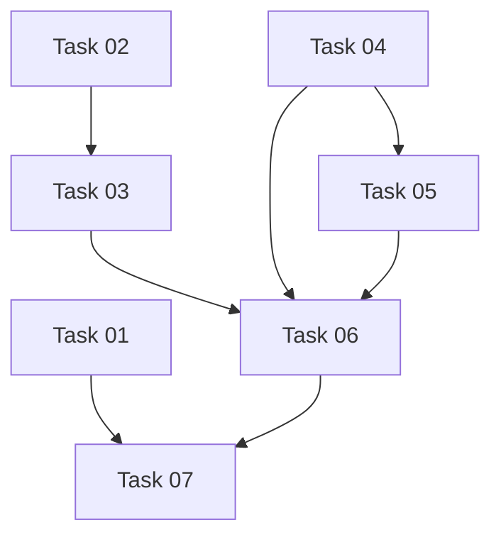

# Post-Refactor Stability Task Plan

## Executive Summary

The repository remains blocked because the audit findings are still present on the current branch at `a1ad1c8`. Episode 022 dry-run source resolution works for `en/full`, `de/full`, `en/short`, and `de/short`, but production readiness is not proven: `shots validate` cannot find visual-retention shot plans, one focused story-localization regression test fails, and no cross-manifest validator verifies artifact references across the media pipeline.

Release blockers:

- F1: missing visual-retention shot-plan artifacts.
- F2: story-localization routing coverage failure.
- F6: missing cross-manifest referential-integrity validation.

Architectural hardening:

- F3: resolver cache identity omits the canonical relative authored-script path.
- F4: CLI source adapter collapses resolver metadata to a file path.
- F5: `episode validate` currently reports dry-run planning instead of validating existing artifacts.

Recommended order:

1. Task 01 - restore story-localization routing coverage.
2. Task 02 - correct authored-script cache identity.
3. Task 03 - propagate resolver metadata downstream.
4. Task 04 - make shot-plan validation reproducible.
5. Task 05 - separate episode validation from dry-run planning.
6. Task 06 - add cross-manifest referential-integrity validation.
7. Task 07 - run broad verification and controlled smoke planning.

## Verified Finding Status

| Finding | Current status | Severity | Affected packages | Evidence | Mapped task |
|---|---|---|---|---|---|
| F1: Missing visual-retention shot-plan artifacts | confirmed | blocker | `apps/cli`, `packages/visual-planning`, `packages/shared`, `packages/domain` | `episodes/022-the-whistler-in-the-woods/state/visual-retention` has no files. `node apps/cli/bin/mediaforge.js shots validate --episode 022-the-whistler-in-the-woods --locale en --variant full --format json` exits 1 with missing `shot-plan.full.en.json`. Canonical path helpers exist in `packages/shared/src/episode-filesystem.ts` (`resolveEpisodeShotPlanPath`, `resolveEpisodeShotValidationPath`). | Task 04 |
| F2: Story-localization focused test failure | confirmed | high | `packages/story-localization` | `pnpm test:focused -- packages/story-localization/src/story-localization.unit.test.ts -t "rejects localized full outputs that would require short-specific repair"` fails at `packages/story-localization/src/story-localization.unit.test.ts:549`: expected `Short word count`, received `Character names are missing.` The invariant is full-vs-short repair routing, not first-message ordering. | Task 01 |
| F3: Resolver cache identity omits canonical relative script path | confirmed | medium | `packages/shared`, downstream cache consumers | `resolveAuthoredScript` in `packages/shared/src/episode-filesystem.ts` returns `relativePath`, `contentHash`, `cacheIdentity`, and `resolverVersion`, but builds `cacheIdentity` as `authored-script-resolver-v1:<episode>:<language>:<variant>:<contentHash>`. `packages/shared/src/episode-filesystem.unit.test.ts` asserts that current shape. | Task 02 |
| F4: Downstream resolver metadata is collapsed to a file path | confirmed | medium | `apps/cli`, likely consumers in `packages/story-localization`, `packages/speech`, `packages/metadata`, `packages/rendering` | `resolveEpisodeLanguageSource` in `apps/cli/src/episode-commands.ts` calls `resolveAuthoredScript` but returns only `{ sourceFile: resolved.absolutePath }`. `prepareEpisodeLanguage` threads only `sourceFile` into `buildEpisodeLoadResult`, review records, and summaries. | Task 03 |
| F5: `episode validate` duplicates dry-run semantics | confirmed | medium | `apps/cli` | `commandEpisodeValidate` in `apps/cli/src/episode-commands.ts` is exactly `await commandEpisodeDryRun({ ...options, dryRun: true })`. `node apps/cli/bin/mediaforge.js episode validate --episode 022-the-whistler-in-the-woods --language en --artifact full --json` exits 0 and emits `"dryRun": true`. | Task 05 |
| F6: No cross-manifest referential-integrity validator found | confirmed | high | `apps/cli`, placement to be decided; likely `packages/domain`, `packages/shared`, `packages/visual-planning`, `packages/speech`, `packages/metadata`, `packages/rendering`, `packages/image-generation` | Package-local schemas and validators exist, such as `shotPlanSchema`, `scenePlanSchema`, `narration*Schema`, metadata validation, and shot validation, but no repository-wide validator was found that checks authored source, rewrite/localization artifacts, scene plans, visual plans, image manifests, narration manifests, render manifests, metadata, and resume/checkpoint state together. | Task 06 |

## Task Dependency Graph

Readable graph:

- Task 01 has no implementation dependency and feeds Task 07.
- Task 02 precedes Task 03.
- Task 03 precedes Task 06.
- Task 04 precedes Tasks 05 and 06.
- Task 05 precedes Task 06.
- Task 06 precedes Task 07.

## Execution Batches

Sequential in one Codex session:

- Tasks 02 and 03 are safe and beneficial to run sequentially in one session because Task 03 depends on the source identity defined by Task 02 and both touch resolver/source-descriptor surfaces. Keep one commit for the combined implementation only if the user explicitly asks for a combined commit.
- Tasks 04 and 05 may run sequentially only after Task 04 resolves shot-plan artifact ownership, because `episode validate` should consume the statuses introduced by Task 04.

Parallel in separate worktrees:

- Task 01 can run in parallel with Tasks 02 and 03 because it is isolated to `packages/story-localization` tests and routing behavior.
- Task 04 can start in parallel with Task 01 and Task 02, but must not overlap with Task 05 or Task 06 once it edits shared validation/report surfaces.

Only after another task:

- Task 03 only after Task 02.
- Task 05 only after Task 04 defines visual-retention artifact ownership and validation statuses.
- Task 06 only after Tasks 03, 04, and 05.
- Task 07 only after Tasks 01 through 06 are merged or intentionally batched.

Never concurrently:

- Tasks 02 and 03 should not run in separate worktrees because both will edit resolver metadata and likely `apps/cli/src/episode-commands.ts` and related tests.
- Tasks 04 and 05 should not run concurrently because both are expected to touch CLI validation semantics and visual-retention validation reporting.
- Tasks 05 and 06 should not run concurrently because Task 06 should wire into the finalized validation report contract.

## Branch And Commit Strategy

Branch naming:

- `fix/post-refactor-task-01-story-routing`
- `fix/post-refactor-tasks-02-03-resolver-source-identity`
- `fix/post-refactor-task-04-shot-plan-reproducibility`
- `fix/post-refactor-task-05-episode-validation`
- `fix/post-refactor-task-06-manifest-integrity`
- `chore/post-refactor-task-07-verification`

Worktrees:

- Use separate worktrees for Task 01 and Tasks 02-03 if parallel execution is needed.
- Keep Tasks 04, 05, 06, and 07 isolated unless the same engineer owns the full chain.

Commit strategy:

- Prefer one commit per task.
- Combine Tasks 02 and 03 only when implemented in one session and reviewed together.

Suggested conventional commits:

- `test(story-localization): restore full repair routing coverage`
- `fix(shared): include authored script path in resolver identity`
- `fix(cli): preserve authored source resolver metadata`
- `fix(visual-planning): make shot plan validation reproducible`
- `fix(cli): separate episode validation from dry-run planning`
- `feat(cli): add cross-manifest artifact integrity validation`
- `chore(validation): record post-refactor verification matrix`

## Merge Gates

Final checklist:

- [ ] Focused tests for every changed package pass.
- [ ] Changed-package typechecks pass.
- [ ] Repository-wide typecheck is run after explicit human authorization.
- [ ] Lint is run after explicit human authorization.
- [ ] Tests are run after explicit human authorization.
- [ ] Build is run after explicit human authorization.
- [ ] Four dry-run cells pass: `en/full`, `de/full`, `en/short`, `de/short`.
- [ ] Four validation cells pass and do not report themselves as dry-runs.
- [ ] Four shot-validation cells pass without relying on `--no-visual-retention`.
- [ ] Controlled no-upload smoke plan is documented.
- [ ] No unintended paid calls occurred.
- [ ] YouTube upload was not run.
- [ ] Remote rendering was not run unless explicitly approved.

## Paid-Call Policy

- Tasks 01 through 06 must not make paid provider calls.
- Tests must use fixtures, mocks, deterministic local implementations, or temporary workspaces.
- Task 07 may document a controlled paid smoke, but must not execute it unless the user explicitly authorizes paid execution.
- YouTube upload is prohibited.
- Remote rendering is prohibited unless explicitly approved.
- Do not generate paid-provider assets.
- Do not call OpenAI, TTS, transcription, image generation, remote render, or upload providers from implementation or validation for Tasks 01 through 06.

## Architectural Decisions

- Shot-plan ownership is not fully resolved by code. Existing code treats visual-retention files as canonical `state/visual-retention` artifacts through `packages/shared/src/episode-filesystem.ts`, and `apps/cli/src/shots.ts` can create deterministic plans. Task 04 must decide whether repository-owned episode shot plans are committed source assets, reproducible derived artifacts, or ephemeral outputs before adding acceptance proof for episode 022.
- Cross-manifest validator placement must avoid dependency cycles. `@mediaforge/shared` has no internal workspace dependencies, while `@mediaforge/domain` owns schemas. A validator that needs domain schemas should not live in `shared`. Prefer CLI-first orchestration or a validation package that depends on `domain` and `shared`.
- Validation exit codes are not standardized globally. `packages/speech/src/narration-pipeline.ts` defines narration-specific exit codes and `apps/cli/src/shots.ts` sets `process.exitCode = 1` for invalid shots. Task 05 must inspect existing CLI exit handling before defining episode-validation codes.
- Old resolver cache identities should be invalidated by a versioned identity change. Task 02 should bump the resolver/schema identity or otherwise treat `authored-script-resolver-v1:<episode>:<language>:<variant>:<hash>` as stale.
- Downstream consumers should receive a cohesive typed source descriptor rather than many primitive arguments. The descriptor should preserve appropriate resolver metadata: absolute path, canonical relative path, content hash, resolver version, and cache identity.

## Plan Validation

Before implementation starts, confirm:

- [ ] Every confirmed finding maps to at least one task.
- [ ] Every task has explicit dependencies.
- [ ] No task requires a paid provider call.
- [ ] Validation commands exist in `package.json` or are direct CLI commands already present.
- [ ] Package names match workspace package names.
- [ ] Referenced existing file paths exist, and proposed paths are marked as proposed.
- [ ] Mermaid graph matches task metadata.
- [ ] Execution prompts match task dependencies.
- [ ] No task reintroduces the removed legacy pipeline.
- [ ] Final acceptance does not use `--no-visual-retention` as visual-retention proof.
