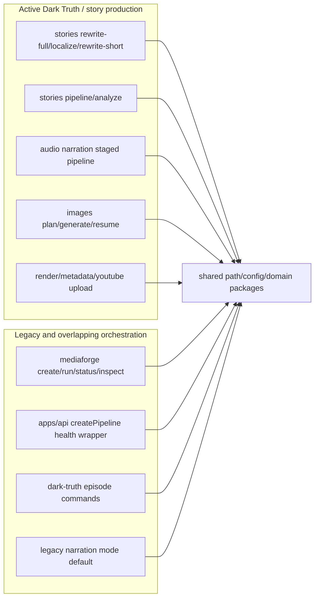
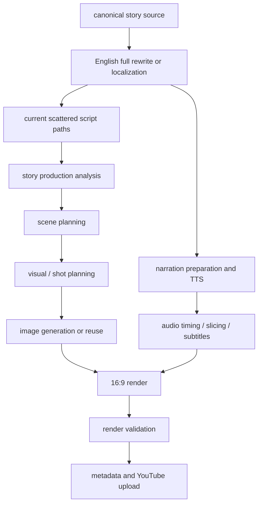
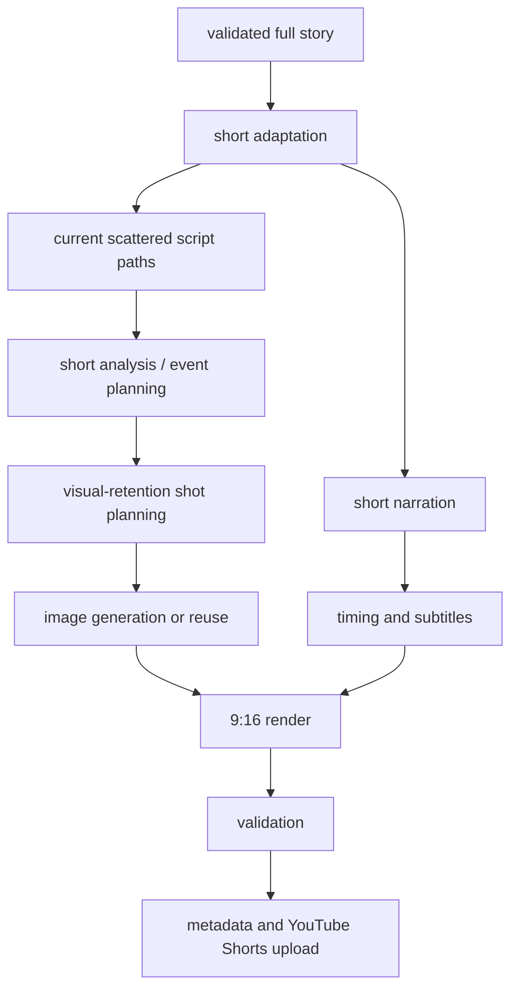
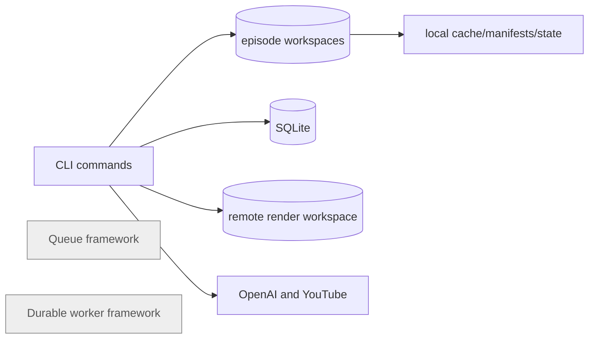

# Current System Architecture

## Repository-level architecture

```mermaid
flowchart TD
  CLI[apps/cli primary operator surface]
  API[apps/api minimal HTTP wrapper]
  WEB[apps/web static surface]
  Story[@mediaforge/story-localization]
  Speech[@mediaforge/speech]
  Images[@mediaforge/image-generation]
  Render[@mediaforge/rendering]
  Metadata[@mediaforge/metadata]
  Upload[@mediaforge/youtube-upload]
  Pipeline[@mediaforge/pipeline legacy orchestration]
  DarkTruth[@mediaforge/dark-truth overlapping episode orchestration]
  Shared[@mediaforge/shared/domain/config/persistence]
  FS[(episode workspace filesystem)]
  DB[(SQLite manifests/runs/steps)]
  External[OpenAI / ffmpeg / remote render / YouTube]

  CLI --> Story
  CLI --> Speech
  CLI --> Images
  CLI --> Render
  CLI --> Metadata
  CLI --> Upload
  CLI --> Pipeline
  CLI --> DarkTruth
  API --> Pipeline
  WEB --> Shared
  Story --> Shared
  Speech --> Shared
  Images --> Shared
  Render --> Shared
  Metadata --> Shared
  Upload --> Shared
  Pipeline --> Shared
  DarkTruth --> Shared
  Shared --> FS
  Shared --> DB
  Story --> External
  Speech --> External
  Images --> External
  Render --> External
  Metadata --> External
  Upload --> External
```

## Dark Truth and legacy coexistence



## Full-video pipeline



## Short pipeline



## Storage and queue boundaries



No BullMQ, durable workflow server, Kubernetes, Terraform, or root GitHub Actions wiring was found in the inspected source tree. Treat queue/workflow items as absent unless later implementation finds deployment-only wiring outside this workspace.
