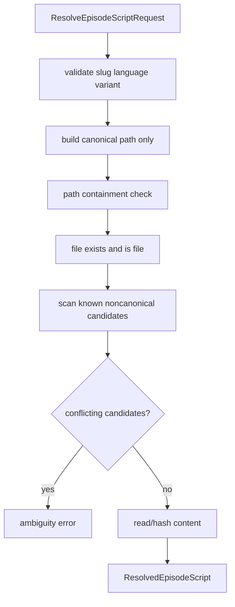

# Script Resolution Architecture

## Responsibility

Add one central resolver in shared or a Dark Truth application package. It resolves authored episode scripts for every active story, narration, analysis, scene, image, render, and publishing entry point.

## Types

```ts
type EpisodeSlug = string & { readonly __brand: "EpisodeSlug" };
type LanguageCode = LocaleCode;
type ScriptVariant = "full" | "short";
type AbsolutePath = string & { readonly __brand: "AbsolutePath" };
type ScriptContentHash = string & { readonly __brand: "ScriptContentHash" };

interface ResolveEpisodeScriptRequest {
  readonly workspaceRoot: string;
  readonly episodeSlug: EpisodeSlug;
  readonly language: LanguageCode;
  readonly variant: ScriptVariant;
}

interface ResolvedEpisodeScript {
  readonly episodeSlug: EpisodeSlug;
  readonly language: LanguageCode;
  readonly variant: ScriptVariant;
  readonly absolutePath: AbsolutePath;
  readonly relativePath: RelativePath;
  readonly contentHash: ScriptContentHash;
  readonly cacheIdentity: string;
  readonly logContext: {
    readonly episodeSlug: string;
    readonly language: string;
    readonly variant: string;
    readonly relativePath: string;
    readonly contentHash: string;
  };
}
```

## Error types

- `InvalidEpisodeSlugError`
- `InvalidLanguageCodeError`
- `InvalidScriptVariantError`
- `ScriptPathTraversalError`
- `EpisodeScriptNotFoundError`
- `AmbiguousEpisodeScriptLayoutError`
- `InvalidEpisodeScriptLayoutError`

## Deterministic lookup



Full path: `languages/script-<language>.md`.

Short path: `languages/short/script-<language>.md`.

## Required consumers

- `story-full-rewrite-command.ts`
- `story-short-rewrite-command.ts`
- `story-analysis-command.ts`
- `story-production-analysis.persistence.ts`
- `full-rewrite.resolution.ts`
- `short-rewrite.resolution.ts`
- `apps/cli/src/index.ts` audio narration and localized audio helpers.
- `apps/cli/src/episode-commands.ts`
- `packages/dark-truth/src/index.ts` until moved.
- `packages/speech/src/script-markdown.ts` and narration pipeline entry points.
- Any scene/image/render/metadata command that currently takes `episodeDir` and reconstructs script paths.

## Cache identity

Cache keys must include resolver version, episode slug, language, variant, relative path, and content hash. Never key only by episode or root `script.md`.
