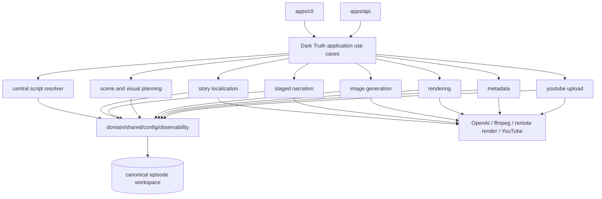
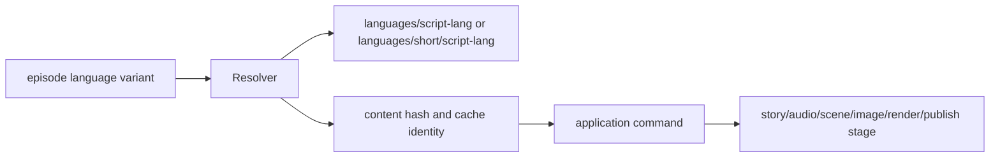

# Target Architecture

## Final repository shape

## Canonical script flow

## Removed

- `@mediaforge/pipeline` package and imports.
- Root legacy CLI flow, unless replaced by aliases to active use cases during transition.
- `apps/api` dependency on pipeline.
- Root `script.md` and `<language>/<variant>/script.md` as authored script sources.
- Legacy narration mode after staged narration is the only production mode.
- Legacy image/audio/transcript path fallbacks after migration.

## Preserved

- Full-video and Short Dark Truth pipelines.
- Sync and batch image strategies when active.
- Local, remote, and hybrid rendering.
- Staged narration cache and quality gates.
- Metadata generation and YouTube upload.
- Historical generated artifacts unless explicitly cleaned operationally.
