# Story Pipeline Dependency Graphs

## Current Workflow

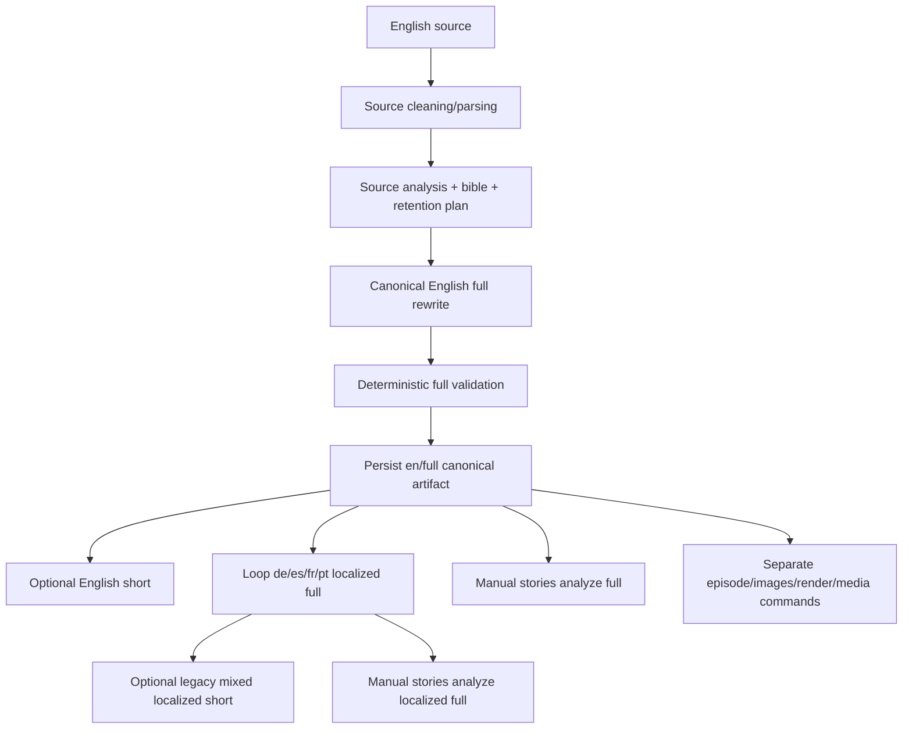

## Recommended Workflow

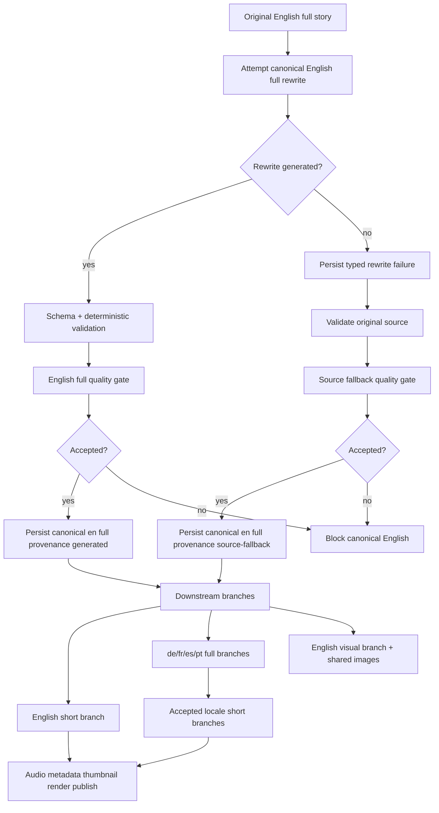

## English Critical Path

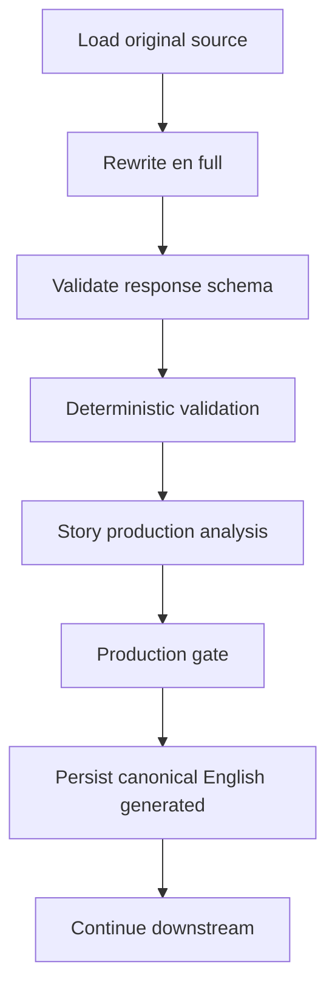

## English Fallback

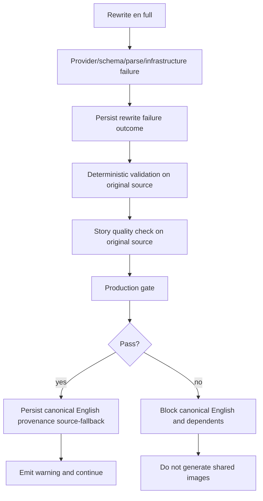

## Locale Fallback

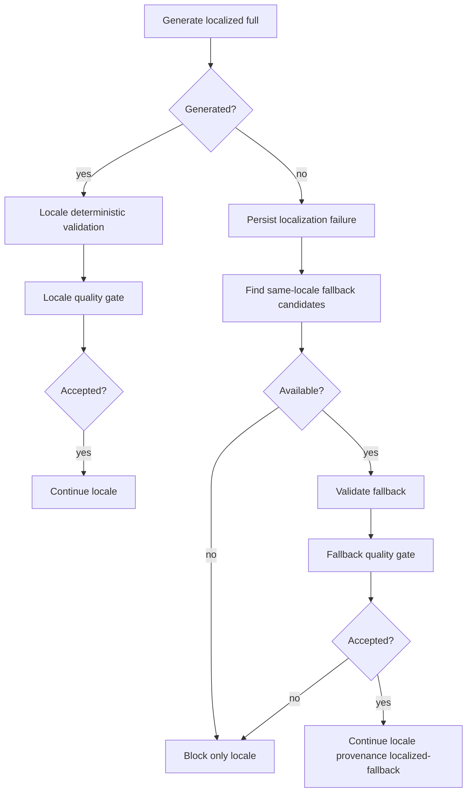

## Locale Branching

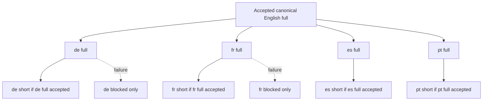

## Full And Short Independence

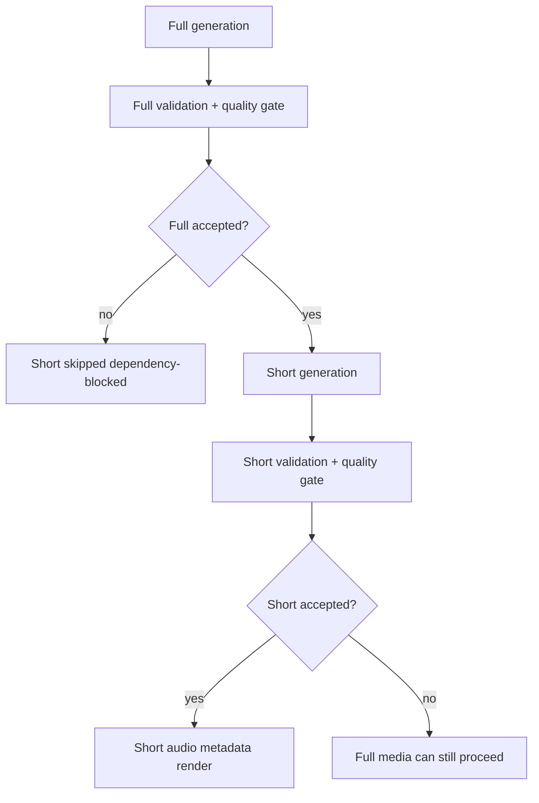

## Visual Branch

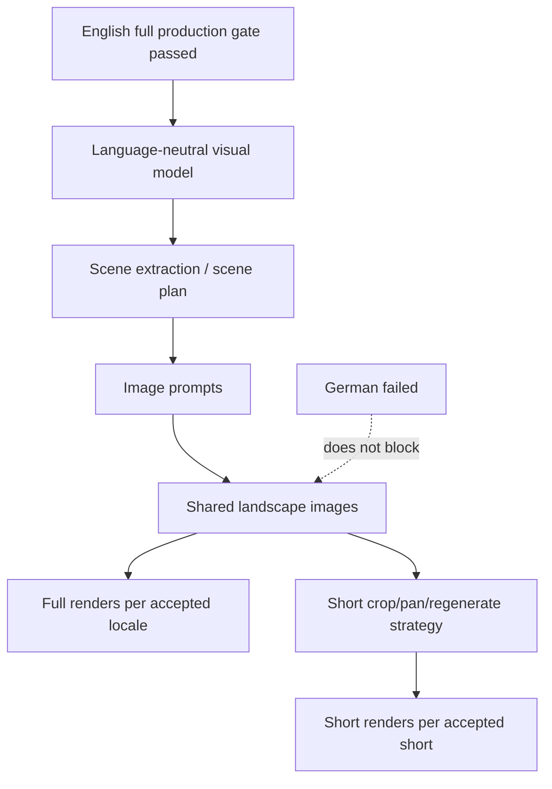

## Provider Batch Submission

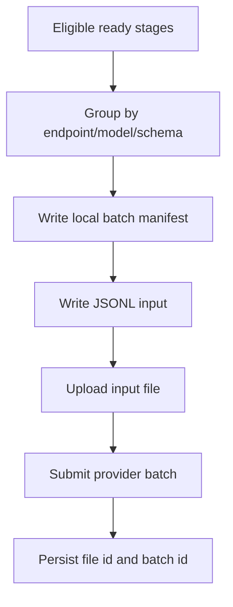

## Provider Batch Reconciliation

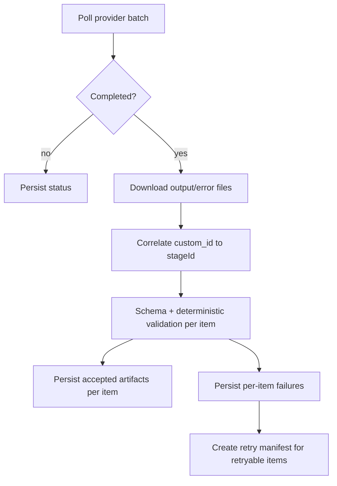

## Retries

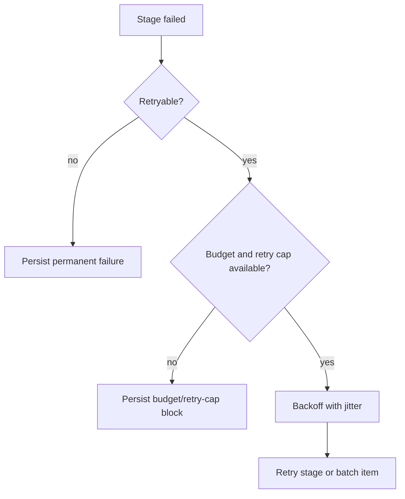

## Resume

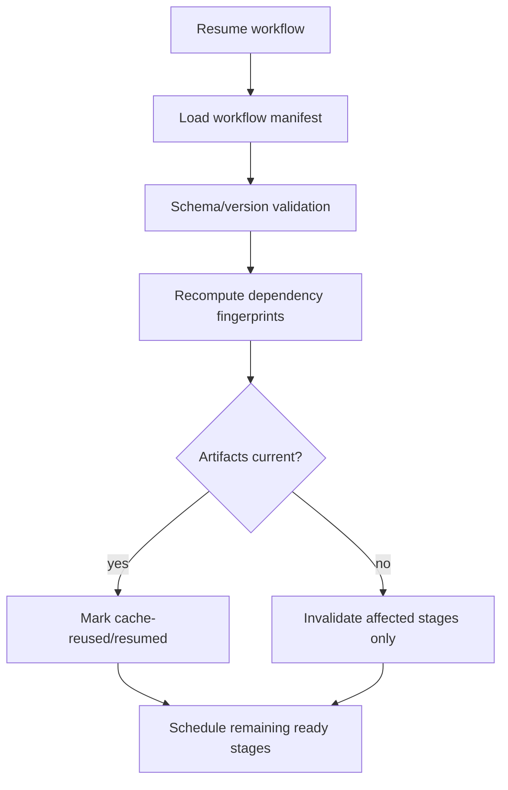

## Invalidation

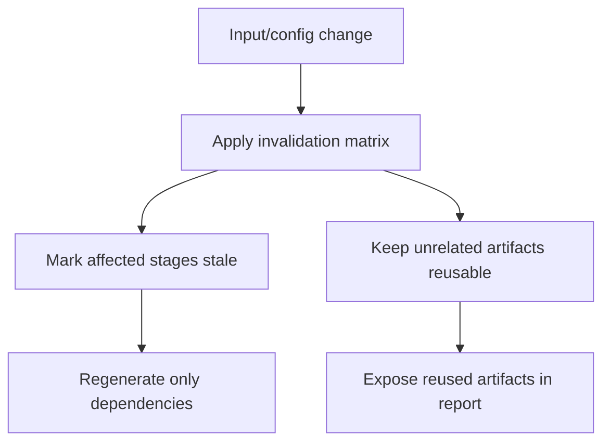

## Render Dependencies

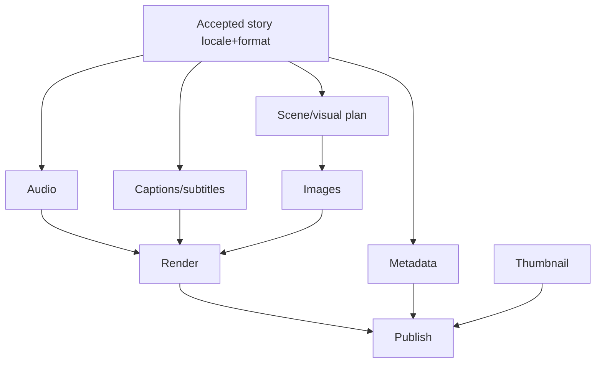
