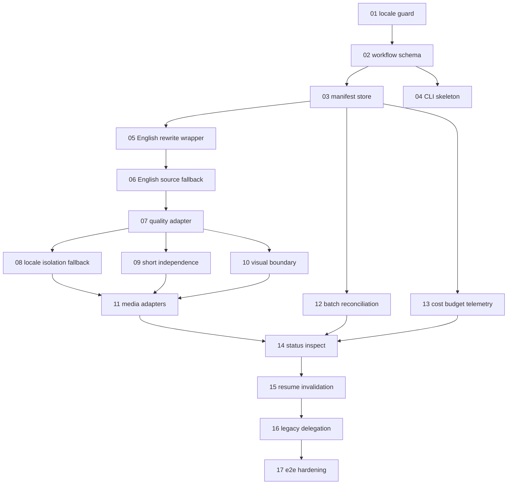

# Story Pipeline Implementation Roadmap

## Phases

1. Foundation: locale guard, schema contracts, manifest persistence, workflow report shape.
2. Story critical path: English rewrite wrapper, source fallback, quality gate adapter.
3. Branching: locale isolation/fallback, independent short gates.
4. Visual and media: English visual boundary, images, audio, metadata, thumbnails, renders, publish dependencies.
5. Batch and cost: provider batch grouping/reconciliation, budgets, telemetry.
6. CLI and compatibility: unified command, status/inspect, legacy delegation, deprecation warnings.
7. Hardening: invalidation, resume, concurrency locks, end-to-end tests.

## Task Order

Critical path:

1. Locale guard and `sp` compatibility audit.
2. Workflow schema and manifest store.
3. CLI skeleton and dry-run graph output.
4. English rewrite stage wrapper.
5. English source fallback quality flow.
6. Quality gate adapter for full/short.
7. Locale branch isolation and fallback resolver.
8. Independent short stage/gate integration.
9. Visual branch dependency boundary.
10. Media stage adapters.
11. Batch reconciliation.
12. Cost/budget telemetry.
13. Status/inspect reports.
14. Resume/invalidation.
15. Legacy command delegation.
16. E2E hardening.

## Task Dependency Graph

## Critical Path

Tasks 01 through 07 are the safest first path because they resolve locale identity, persistence, English fallback, and quality semantics before broad downstream work.

## Parallel Batches

- Batch A after Task 03: Task 04 CLI skeleton, Task 12 batch schema adapter, Task 13 cost schema work.
- Batch B after Task 07: Task 08 locale fallback, Task 09 short independence, Task 10 visual boundary.
- Batch C after Task 11: Task 14 status/inspect and Task 15 resume/invalidation can begin with coordination.

## Migration Milestones

- M1: workflow manifest can represent all required outcomes without running providers.
- M2: English rewrite failure can continue through accepted source fallback.
- M3: locales and shorts are independently gated.
- M4: images start from accepted English visual prerequisites only.
- M5: provider batch failures retry per item.
- M6: legacy commands delegate without behavior loss.

## Compatibility Milestones

- No production source modifications in planning.
- Root and story-localization guardrails preserved.
- Existing command flags preserved.
- Existing artifact paths readable.
- `sp` prevented from creating new branch.

## Deprecation Milestones

- Characterize mixed localized full+short.
- Stop using mixed path in unified command.
- Add warning only after parity.
- Remove only after e2e and migration tests prove safe.

## Model Allocation

- GPT-5.4 Medium: locale guard, schemas, CLI wiring, status formatting, unit tests, documentation, deprecation warnings.
- GPT-5.5 Medium: orchestration wrappers, fallback routing, persistence, batch reconciliation, cost/budget telemetry, invalidation.
- GPT-5.5 High: central scheduler behavior if DAG concurrency, transactional migration, or command delegation creates cross-package compatibility risk.

## Risk Checkpoints

- Before Task 05: schema IDs and locale behavior stable.
- Before Task 08: English fallback semantics tested.
- Before Task 11: full/short quality independence tested.
- Before Task 16: status/inspect reports stable and legacy behavior characterized.
