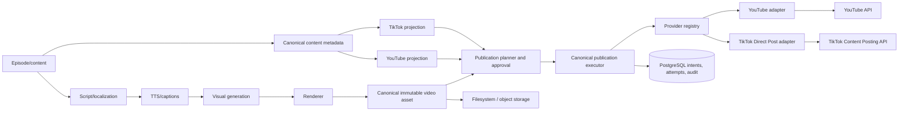
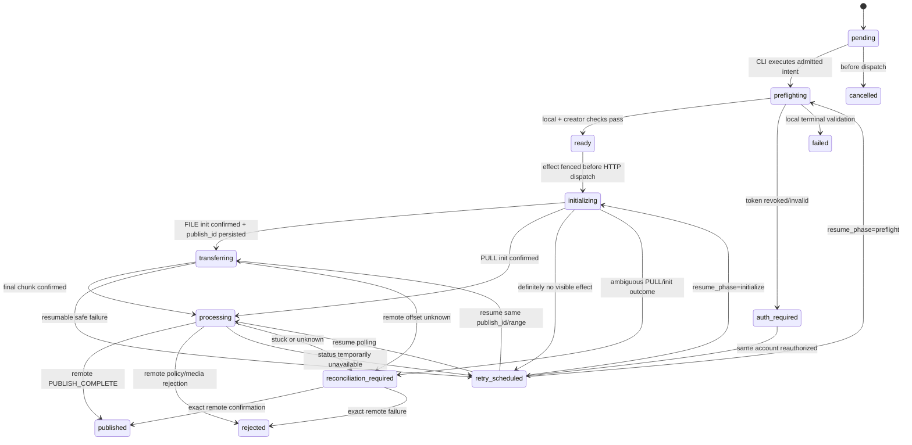

# Production-Grade TikTok Publishing Integration Plan

Status: READY

Production rollout remains blocked by TikTok app audit/approval, but repository
implementation through the disabled and mock-tested phases is ready to begin.

## A. Executive summary

- Extend the repository's existing canonical publication executor, immutable
  intent, PostgreSQL leases, fences, outbox, approvals, and reconciliation
  model. Do not introduce NestJS, Prisma, or RabbitMQ: none is currently used.
- Introduce a provider-neutral, discriminated publication contract with
  type-safe YouTube and TikTok requests. Keep the active `youtube upload`
  behavior unchanged until parity tests justify migration.
- Implement TikTok through the official Content Posting API Direct Post flow
  using direct HTTP.
- Default to `FILE_UPLOAD`. Canonical videos are filesystem-first, the
  S3-compatible adapter is not proven to be production-composed, and FILE
  upload provides safer recovery when initialization responses are lost.
- Keep publication initiation operator-driven and CLI-only under
  `ADR-OPERATIONS-001`. The API/web surface may authorize accounts, query
  creator information, render previews, collect immutable consent, expose
  status, and reconcile; it must not initiate or schedule publication.
- Gate public TikTok publishing on successful TikTok audit. Unaudited operation
  is canary-only and `SELF_ONLY`.
- Use one immutable publication per provider/account/content revision. Retries
  continue the same remote `publish_id`; no ambiguous side effect may trigger
  a new initialization blindly.

## B. Current-state architecture

### Pipeline map

```text
content pack / episode manifest
    ↓
source ingestion and canonical script
    ↓
locale/variant adaptation
    ↓
TTS and captions
    ↓
visual planning and image generation
    ↓
render + render.json
    ↓
YouTube-specific metadata artifact
    ↓
apps/cli `youtube upload`
    ↓
packages/youtube-upload
    ↓
YouTube Data API
```

Current identity and artifact conventions:

| Concept | Current source |
| --- | --- |
| Canonical episode ID | Episode manifest and `episodes/<episode-id>` filesystem identity |
| Locale and variant | `episodes/<id>/locales/<locale>/<full\|short>` |
| Canonical short video | `renders/vertical/vertical-final.mp4` plus `renders/vertical/render.json` |
| Canonical long video | `renders/youtube/youtube-final.mp4` plus render manifest |
| Asset identity | Manifest asset ID, SHA-256, MIME, and byte count; legacy upload can still fall back to filesystem scanning |
| Metadata | YouTube artifact with prompt/model/cache/provenance records; a lightweight TikTok heuristic exists but is not production publishing metadata |
| Provider identity | Mostly implicit YouTube |
| Account identity | YouTube channel ID and locale-specific refresh-token environment slots |
| Publication identity | Legacy upload report hashes, or the newer canonical `publicationId` and recovery identity |
| Publication status | Canonical `pending`, `executing`, `published`, `failed`, `reconciliation_required`, `cancelled` |
| Durable execution | PostgreSQL jobs/outbox, leases, heartbeats, fencing, dead letters, and immutable workflow events |
| Queue technology | PostgreSQL-backed workers; no RabbitMQ, BullMQ, or Redis queue |
| Database technology | Raw PostgreSQL migrations/repositories; no Prisma schema or Prisma dependency |

Two publication paths coexist:

1. The active `apps/cli/src/index.ts` command calls `uploadYoutubeEpisode` in
   `packages/youtube-upload`. It verifies the channel, streams a resumable
   YouTube upload, applies thumbnail/playlist mutations, writes filesystem
   reports, and skips matching prior reports. Its legacy mutation sequence owns
   HTTP retries, including retrying `videos.insert`, which creates an ambiguous
   duplicate risk.
2. The safer canonical path in `packages/workflow-engine`,
   `packages/application`, and `packages/persistence` admits immutable
   publication intents, validates approvals and authority, claims intent/account
   leases, fences execution, calls a one-shot YouTube mutation, and moves
   ambiguous results to reconciliation. This path is well tested but is not the
   active CLI uploader's main execution path.

Other findings:

- `publication_credential_versions` stores immutable authority facts but not
  credential secrets.
- `publication_channel_leases` serializes publishing by YouTube channel.
- `effect_records` and reconciliation are currently YouTube-shaped.
- `S3TenantObjectStorage` provides tenant-scoped, immutable S3-compatible
  storage and signed reads, but no deployment composition proving public
  MinIO/S3 access was found.
- `validateRenderedVideo` uses existing media inspection, but TikTok-specific
  container, byte-size, frame-rate, creator-duration, and URL checks are absent.
- Logging is Pino with partial redaction. JSON telemetry and audit facts exist,
  but no Prometheus/OpenTelemetry production exporter was found.
- The API exposes safe publication reads, approvals, and reconciliation. The
  accepted ADR prohibits API-triggered publication and factory scheduling.
- Tests inject fake YouTube clients and fake PostgreSQL query layers; focused
  unit and PostgreSQL integration suites are established.

### YouTube-specific coupling to remove or isolate

- `canonicalPublishEpisodeInputSchema.providerRequest` is entirely
  YouTube-shaped.
- Target fields assume channel, YouTube visibility, playlists, thumbnail, and
  `publishAt`.
- Credential authority and leases are channel-named.
- Reconciliation searches a YouTube description recovery marker.
- `youtubePublicationIntentSchema` contains account/channel fields but is
  explicitly YouTube and dispatch-disabled.
- Metadata limits, visibility, scheduling, thumbnails, and child-directed flags
  are embedded in shared publication input.
- Locale/account credentials are process environment variables.
- The active CLI skips the safer canonical executor.
- Metrics, audit evidence, and effect kinds do not consistently include
  provider/account/attempt identity.

## C. Gap analysis

Required additions:

- Explicit provider and provider-account identities throughout the publication
  domain.
- Encrypted, multi-account OAuth storage with refresh-token rotation and
  reauthorization.
- TikTok creator-facing review, privacy, interaction, commercial-disclosure,
  AI-content, and consent UX.
- TikTok-specific metadata artifact and provenance.
- TikTok API client, error mapping, streaming upload, polling, and webhook
  processing.
- Provider-aware state and status observations.
- Durable operation attempts and retry classification.
- Provider/account concurrency controls and endpoint token buckets.
- Production metrics/traces and broader secret redaction.
- Account routing by project, locale, and variant.
- Additive schema migration and legacy YouTube backfill.
- A gradual route from the legacy YouTube uploader to the canonical provider
  factory.

The official TikTok guidelines are a major operational constraint: Direct Post
is intended for creator-facing sharing products, not an internal utility
managing team accounts. Required UX includes current creator information,
manual privacy choice without a default, manually enabled interaction settings,
and explicit consent. Public visibility requires audit approval. See the
[TikTok Content Sharing Guidelines](https://developers.tiktok.com/doc/content-sharing-guidelines/).

## D. Proposed target architecture

### Component boundaries



### Provider contract

Do not use a single opaque `publish()` call: TikTok initialization, transfer,
and remote processing need durable checkpoints.

```ts
type PublicationProvider = "youtube" | "tiktok";

type ProviderRequestMap = {
  youtube: YoutubePublicationRequest;
  tiktok: TikTokPublicationRequest;
};

type ProviderInitializationMap = {
  youtube: YoutubeInitialization;
  tiktok: TikTokInitialization;
};

interface PublicationProviderAdapter<P extends PublicationProvider> {
  readonly provider: P;
  readonly capabilities: ProviderCapabilities<P>;

  preflight(input: ProviderRequestMap[P]): Promise<ProviderPreflight<P>>;
  initializeOnce(
    input: ProviderRequestMap[P]
  ): Promise<ProviderInitializeOutcome<ProviderInitializationMap[P]>>;
  continueTransfer(
    initialization: ProviderInitializationMap[P]
  ): Promise<ProviderTransferOutcome>;
  fetchStatus(
    request: ProviderStatusRequest<P>
  ): Promise<ProviderStatusObservation<P>>;
}
```

- `preflight` covers local media, immutable bindings, account, consent, and
  provider read-only validation.
- `initializeOnce` exposes the uncertain-effect boundary and returns confirmed,
  failed-before-effect, or ambiguous.
- `continueTransfer` resumes the same TikTok `publish_id`; YouTube can implement
  it as part of its resumable session.
- `fetchStatus` is read-only and always retryable subject to authentication and
  rate limits.
- `cancelPull` is an optional TikTok capability only when `PULL_FROM_URL` is
  enabled.
- Metadata `prepare` belongs in the metadata projection layer, not the provider
  adapter.
- OAuth refresh belongs in a credential service.
- `delete` is omitted because the reviewed TikTok Content Posting API does not
  provide a general published-post deletion operation.
- Capability types explicitly expose scheduling mode, transfer methods, cover
  support, interaction settings, reconciliation strength, and cancellation.

### Authority boundaries

- `apps/web`: OAuth initiation/callback, creator preview, settings, explicit
  consent.
- `apps/api`: account/planning/approval/status/reconciliation APIs; no publish or
  schedule endpoint.
- `apps/cli`: sole publication dispatcher, one admitted publication at a time.
- Background reconciliation process: status polling and webhook consumption
  only; it must never initialize or re-upload.
- PostgreSQL: authoritative immutable publication intent, operation attempts,
  remote IDs, observations, and audit.
- Provider HTTP clients: no automatic retry.

## E. Data model changes

There is no Prisma schema. Implement additive raw PostgreSQL migrations in the
existing persistence layer.

### New `publisher_accounts`

- `workspace_id TEXT NOT NULL`
- `publisher_account_id TEXT NOT NULL`
- `provider TEXT NOT NULL CHECK (provider IN ('youtube','tiktok'))`
- `provider_user_id TEXT NOT NULL` — TikTok `open_id` or YouTube channel identity
- `provider_username TEXT NULL`
- `display_name TEXT NULL`
- `state TEXT NOT NULL CHECK (state IN ('active','auth_required','disabled','revoked'))`
- `revision BIGINT NOT NULL DEFAULT 0`
- `created_at`, `updated_at`, `revoked_at`
- Primary key `(workspace_id, publisher_account_id)`
- Unique `(workspace_id, provider, provider_user_id)`

### New `publisher_oauth_credentials`

- `workspace_id`, `credential_version`, `publisher_account_id`
- `oauth_client_key_id`
- `access_token_ciphertext BYTEA`
- `refresh_token_ciphertext BYTEA`
- `encryption_key_version TEXT`
- `access_expires_at`, `refresh_expires_at`
- `scopes TEXT[]`
- `state CHECK ('active','superseded','revoked','outcome_uncertain')`
- `created_at`, `rotated_at`, `revoked_at`
- Foreign key to `publisher_accounts`
- Partial unique index allowing one active credential per account
- Tokens are envelope-encrypted; the KEK remains in a deployment secret manager.

### New `publisher_account_routes`

- `workspace_id`, `route_id`, `project_id`
- `provider`, `locale`, `variant`
- `publisher_account_id`
- `state CHECK ('active','disabled')`
- `revision`, timestamps
- One active route per `(workspace, project, provider, locale, variant)`
- CLI may override a route only by explicit immutable account ID; the preview
  must show the resolved creator and require fresh consent.

### Extend `publication_credential_versions`

- Add `provider`.
- Add `publisher_account_id`.
- Retain `channel_id` for legacy YouTube rows.
- Treat this table as an immutable authorization-grant fact; encrypted token
  material stays in `publisher_oauth_credentials`.

### Extend `publications`

Add:

- `schema_version TEXT`
- `provider TEXT`
- `publisher_account_id TEXT`
- `episode_id TEXT`
- `locale TEXT`
- `variant TEXT`
- `asset_id TEXT`
- `asset_revision TEXT`
- `metadata_revision TEXT`
- `metadata_hash TEXT`
- `request_fingerprint TEXT`
- `phase TEXT`
- `resume_phase TEXT NULL`
- `attempt_count INTEGER DEFAULT 0`
- `next_action_at TIMESTAMPTZ NULL`
- `remote_publish_id TEXT NULL`
- `remote_post_id TEXT NULL`
- `remote_url TEXT NULL`
- `terminal_error_code TEXT NULL`
- `terminal_error_class TEXT NULL`
- `terminal_error_retryable BOOLEAN NULL`

New v2 rows require all provider/content/account identity fields. Existing rows
remain `legacy-v1`; backfill provider as YouTube and create legacy account
records from distinct channel IDs without inventing unavailable locale/variant
data.

Unique constraints:

- `(workspace_id, provider, publisher_account_id, remote_publish_id)` when a
  remote ID exists.
- One publication identity per idempotency fingerprint.
- Active publication uniqueness includes provider and publisher account.

### New `publication_attempts`

One row per operation attempt:

- `workspace_id`, `attempt_id`, `publication_id`
- `operation` — `token_refresh`, `creator_info`, `initialize`, `upload_chunk`,
  `status_fetch`, `cancel_pull`
- `ordinal`
- `state` — `prepared`, `dispatched`, `confirmed`, `failed`, `outcome_uncertain`
- `credential_version`
- `remote_publish_id`
- `provider_log_id`
- `transfer_method`
- `range_start`, `range_end`, `confirmed_remote_bytes`
- `secret_payload_ciphertext`, `secret_key_version`, `secret_expires_at` for a
  resumable upload URL only
- `http_status`, `provider_error_code`, `error_class`, `retryable`
- `started_at`, `dispatched_at`, `completed_at`, `next_retry_at`
- Unique `(workspace_id, publication_id, operation, ordinal)`

### New `tiktok_publication_settings`

- `publication_id`
- `caption`
- `privacy_level`
- `disable_comment`, `disable_duet`, `disable_stitch`
- `video_cover_timestamp_ms`
- `brand_content_toggle`, `brand_organic_toggle`
- `is_aigc`
- `creator_info_hash`, `creator_info_observed_at`
- `consent_actor_id`, `consent_at`, `consent_text_version`
- `metadata_schema_version`, `metadata_hash`
- `creator_info_snapshot JSONB`

Selected settings are explicit columns. Snapshot JSON is permitted only for
provider-returned option evidence and must pass a strict versioned Zod schema.

### New `publication_status_observations`

Append-only:

- `observation_id`, `publication_id`, `remote_publish_id`
- `provider_status`
- `normalized_status`
- `fail_reason`
- `uploaded_bytes`, `downloaded_bytes`
- `remote_post_id`
- `provider_log_id`
- `response_hash`
- `observed_at`

### Generalized durability

- Add `publication_target_leases`, keyed by
  `(workspace, provider, publisher_account_id)`, with the current channel-lease
  heartbeat and fencing rules.
- Generalize effect kinds to operation-specific values such as
  `publication.tiktok.initialize` and `publication.tiktok.upload`.
- Continue using immutable `workflow_events`, `audit_facts`, command admission
  fingerprints, outbox, and reconciliation attempts.
- Enforce transitions and immutable provider/account/content bindings in both
  TypeScript and PostgreSQL triggers.

## F. TikTok API mapping

| Workflow step | Official capability |
| --- | --- |
| User authorization | TikTok OAuth/Login Kit authorization and callback |
| Token exchange/refresh | `POST https://open.tiktokapis.com/v2/oauth/token/` |
| Revoke | `POST https://open.tiktokapis.com/v2/oauth/revoke/` |
| Current creator/options | `POST /v2/post/publish/creator_info/query/` |
| Initialize Direct Post | `POST /v2/post/publish/video/init/`, scope `video.publish` |
| FILE transfer | `PUT` to returned one-hour `upload_url` |
| PULL transfer | `PULL_FROM_URL` in initialization; TikTok downloads immediately |
| Poll status | `POST /v2/post/publish/status/fetch/` |
| Final notifications | `post.publish.complete`, `post.publish.failed`, `post.publish.publicly_available` webhooks |
| Cancel | Best-effort `/v2/post/publish/cancel/`, PULL downloads only |
| Native scheduling | Not provided by the reviewed Direct Post contract |
| Client idempotency/search | No official client idempotency key or local-identity lookup found |

Direct Post initialization is limited to six requests per minute per user
access token and returns the status-tracking `publish_id`. See the
[Direct Post API](https://developers.tiktok.com/doc/content-posting-api-reference-direct-post).

Creator information must be current and supplies allowed privacy values,
disabled interactions, and creator-specific maximum duration. See the
[Creator Info API](https://developers.tiktok.com/doc/content-posting-api-reference-query-creator-info).

Status polling returns processing, completion, failure, transferred bytes, and,
after applicable public moderation, the post ID. See
[Get Post Status](https://developers.tiktok.com/doc/content-posting-api-reference-get-video-status).

## G. Authentication lifecycle

1. A creator starts TikTok authorization in `apps/web`.
2. The API creates a single-use, short-lived, hashed OAuth state bound to
   workspace, principal, intended account route, redirect URI, and PKCE verifier
   where supported.
3. The callback validates state and exchanges the code server-side.
4. Verify returned `open_id`, granted `video.publish` scope, and account
   uniqueness.
5. Encrypt access and refresh tokens before committing them.
6. Resolve account routes to an explicit `publisher_account_id`.
7. Refresh under a database single-flight lock before expiry.
8. Atomically store both new tokens; TikTok may rotate the refresh token, so the
   returned value replaces the previous value. Access tokens are documented as
   24 hours and refresh tokens as 365 days. See
   [TikTok OAuth token management](https://developers.tiktok.com/doc/oauth-user-access-token-management).
9. An ambiguous refresh response marks the credential `outcome_uncertain`; do
   not retry blindly because a rotated token may have been returned but lost.
   Require reauthorization if the old credential no longer works.
10. Revocation or `auth_removed` moves the account to `auth_required` or
    `revoked`; no publication starts until the same TikTok `open_id` is
    reauthorized.
11. A publication freezes the publisher account. Individual operations record
    the credential version used. Reauthorization to a different `open_id`
    cannot resume that publication.

Deployment-wide configuration contains the TikTok client key, redirect URI,
enabled/audit mode, and limits. The client secret and credential-encryption KEK
come from a secret manager. Account-specific tokens live only in encrypted
database rows, never `.env`.

## H. Publication state machine

Use existing lowercase conventions.



- `phase` records `validating`, `initializing`, `uploading`, or `status_polling`.
- Local transitions run from admission through initialization preparation.
- Remote-confirmed transitions include confirmed `publish_id`, chunk progress,
  processing, published, and rejected.
- Known no-effect initialization errors, resumable chunks, read-only status, and
  rate limits are retryable.
- `published`, `failed`, `rejected`, and `cancelled` are terminal.
- `auth_required` and `reconciliation_required` require explicit recovery.
- Provider `UNKNOWN` maps to internal `reconciliation_required`, never terminal
  failure.

## I. Idempotency and retries

### Idempotency identity

Hash a versioned canonical object containing:

```text
provider
publisherAccountId
episodeId
locale
variant
canonical asset ID + SHA-256 + render revision
TikTok/YouTube metadata revision + hash
provider settings hash
consent/approval revision
```

Semantics:

- Identical material reuses the same publication and cannot create another
  remote post.
- Safe retries create operation attempts under the same publication.
- A changed render, metadata, account, privacy/disclosure setting, or consent
  creates a new publication only through explicit
  `publication republish --reason ...` and fresh approval/consent.
- `--force` must never bypass publication idempotency.
- Account identity is immutable after admission.
- TikTok has no usable local idempotency key/search operation, so the guarantee
  is at-most-one automatic dispatch plus deterministic reconciliation, not
  mathematical exactly-once delivery.

### Ambiguous initialization

- FILE_UPLOAD: persist the `publish_id` and encrypted upload URL before sending
  any bytes. If the response is lost, no bytes can be sent; wait for the
  possible one-hour upload URL to expire before allowing a new initialization.
- PULL_FROM_URL: initialization immediately starts the remote download. A lost
  response may already lead to publication and cannot be retried automatically.
- Database failure after FILE init but before persistence: do not upload; allow
  the abandoned remote upload task to expire.
- Database failure after final upload: the `publish_id` was already persisted,
  so recover only through status polling.
- Duplicate queue delivery or process restart must claim the same intent/account
  fence and resume from stored status/remote bytes.

### Retry ownership

The durable operation coordinator invoked by the CLI is the only retry owner.
HTTP clients perform zero automatic retries; the background reconciliation
scheduler performs read-only polling only.

| Operation | Safe retry? | Conditions |
| --- | ---: | --- |
| Local metadata/media validation | Yes | Deterministic and side-effect-free |
| Token refresh | Conditional | Pre-dispatch failure only; ambiguous rotation becomes credential-unknown/reauthorization |
| Creator-info lookup | Yes | Bounded read retry on timeout, 429, or 5xx |
| FILE initialization | Conditional | Retry known failure; after ambiguous response, wait for possible upload URL expiry because no bytes were sent |
| PULL initialization | No after dispatch | Ambiguous result requires reconciliation/operator review |
| FILE chunk upload | Yes | Same `publish_id`; reconcile `uploaded_bytes`/Content-Range before retrying an ambiguous chunk |
| Status lookup | Yes | Read-only; respect rate limits and auth state |
| PULL cancellation | Best effort | Same `publish_id`; never assume cancellation succeeded without status/webhook evidence |

Default limits:

- Creator/status reads: maximum eight transient attempts with full-jitter
  exponential backoff.
- FILE initialization: maximum three known-no-effect attempts.
- Chunk upload: maximum five attempts per range.
- Base delay 2 seconds, cap 60 seconds; `Retry-After` takes precedence.
- Status schedule: 5s, 15s, 30s, 60s, then every 5 minutes through six hours
  and every 30 minutes through 24 hours. After 24 hours, enter
  reconciliation-required rather than failed.

## J. Metadata pipeline

```text
canonical episode metadata
    ├── YouTube projection → YouTube artifact → YouTube publish
    └── TikTok projection  → TikTok artifact  → creator review → TikTok publish
```

Create a strict `tiktok-metadata.v1` artifact containing:

- Episode, locale, variant, and narration fingerprint.
- Caption, hashtags, and CTA.
- Cover timestamp suggestion.
- AI-content determination/provenance.
- Prompt revision, model, reasoning configuration, and output-token limit.
- Model configuration fingerprint and prompt/schema fingerprint.
- Cache key, result hash, response ID where available, and attempt count.
- Generation status and failure evidence.

Rules:

- Never reuse the YouTube title/description directly.
- Caption creative text may use the existing metadata-generation infrastructure,
  but its prompt/schema/cache are TikTok-specific.
- Hashtag normalization, caption UTF-16 length validation, CTA insertion,
  disclosure consistency, and final request projection are deterministic.
- Privacy, interactions, commercial disclosure, and consent are creator-selected
  settings, not LLM output.
- `is_aigc` derives from immutable media provenance and cannot be falsely
  cleared in the UI.
- Cache keys include narration/content hash, locale, variant, prompt revision,
  schema revision, model, and reasoning configuration. Repeated previews do not
  make new paid calls.
- A deterministic non-LLM projection remains available for dry runs and tests.

## K. Media-transfer recommendation

### Default: FILE_UPLOAD

Reasons:

- Canonical production is currently filesystem-first.
- It avoids requiring a public, TikTok-verified storage domain.
- It gives the safest recovery boundary: TikTok cannot publish a FILE
  initialization without receiving bytes.
- Existing renders can be streamed from disk or object storage without loading
  the video into memory.
- Persisting `publish_id` before upload makes process-crash recovery
  deterministic.

Implementation:

- Default chunk size: 32 MiB.
- Files under 5 MiB upload as one chunk.
- Chunks remain within TikTok's 5–64 MiB rule, except the permitted final
  remainder; upload sequentially.
- Stream only the requested byte range with bounded memory.
- Use TikTok's returned Content-Range/uploaded-byte evidence before retrying.
- Enforce an overall transfer deadline that leaves margin before the one-hour
  upload URL expiry.
- Encrypt the upload URL because its query token is a bearer-like secret.

TikTok documents sequential chunks, 5–64 MiB normal chunk bounds, a maximum
128 MiB final chunk, 201/206 completion semantics, retryable 5xx chunk errors,
and byte-progress response headers. See the
[Media Transfer Guide](https://developers.tiktok.com/doc/content-posting-api-media-transfer-guide).

### Deferred capability: PULL_FROM_URL

Enable only after all of these are proven:

- Production S3/MinIO adapter is composed.
- TikTok can reach a first-party HTTPS hostname.
- Domain or URL prefix is verified with TikTok.
- No redirects.
- URL remains valid at least 75 minutes.
- Host/prefix is allowlisted and constructed internally.
- Signed URL query values are redacted and never audited/logged.
- Security accepts object-store egress and URL disclosure.
- The ambiguous-initialization runbook is approved.

PULL can reduce worker duration but worsens idempotency: initialization begins
downloading immediately. TikTok requires owned/verified HTTPS URLs, no
redirects, and accessibility through the one-hour download window.

### Video preflight

Extend the existing ffprobe-backed validation with a TikTok profile:

- Readable container and complete video stream.
- MP4 preferred; reject unsupported container/codec.
- H.264 canonical default.
- Width/height each 360–4096.
- Frame rate 23–60 fps.
- File size at most 4 GiB.
- Duration at most ten minutes and no greater than current
  `max_video_post_duration_sec`.
- Positive duration, expected 9:16 dimensions, and audio stream
  present/readable.
- Validate MIME, byte count, SHA-256, and render-manifest dependency.
- For PULL, perform a controlled HEAD/read probe through the internal storage
  adapter, verify host/prefix/TTL/no redirect, and never accept an arbitrary
  URL.

The current 1080×1920, 30 fps, H.264/AAC vertical short remains canonical when
it passes. Do not create a TikTok-specific render unless preflight demonstrates
incompatibility.

## L. Scheduling strategy

Preserve `ADR-OPERATIONS-001`:

- TikTok publication is operator-initiated, on-demand CLI execution.
- TikTok `scheduledAt` must be null and a future time is rejected.
- The API/web layer cannot schedule or initiate Direct Post.
- YouTube's existing remote `publishAt` behavior remains unchanged.
- Model scheduling capability explicitly as YouTube `provider`, TikTok `none`,
  and future provider `provider`, `factory`, or `none`.
- A future factory-delay implementation requires a new ADR. It would normalize
  RFC3339 input to UTC and make a durable job eligible at the requested instant,
  but is out of current scope.
- Store timestamps in UTC; UI presentation converts to the creator's timezone.

## M. Rate-limit and concurrency strategy

Official per-user-token limits:

- Creator info: 20 requests/minute.
- Direct Post initialization: 6 requests/minute.
- Status fetch: 30 requests/minute.

Configure token buckets per provider account and endpoint, with:

- One side-effecting publication per TikTok account.
- Two simultaneous TikTok uploads globally.
- Four total TikTok HTTP requests globally.
- Reconciliation/status priority over new initialization.
- Full-jitter backoff and exact `Retry-After` handling.
- Default internal daily guard of 10 initializations per account, configurable
  downward or to the audited limit.
- No bulk/fan-out publish command in the initial release.
- Future locale fan-out creates independent account-bound intents and enters the
  same bounded queue.
- Return backpressure/deferred results instead of launching uncontrolled work.

TikTok also applies active-creator and creator posting caps; the documented
typical posting cap is around 15 per creator per day but may vary and is shared
across API clients. Treat provider responses as authoritative.

## N. Security analysis

- Store tokens only as encrypted database ciphertext; keep the KEK and client
  secret in a secret manager.
- Expand redaction for `refreshToken`, `clientSecret`, `uploadUrl`, authorization
  headers, cookies, signed URLs, and URL queries.
- Freeze provider account ID in each publication and verify refreshed
  credentials return the same TikTok `open_id`.
- Display account nickname/username during consent and again in CLI confirmation.
- Resolve account routes transactionally; never fall back to another account.
- Require scoped publish approval plus immutable creator consent bound to asset
  and metadata hashes.
- Use RLS on every new workspace-scoped table.
- Construct PULL URLs only through the tenant storage adapter; enforce HTTPS
  allowlists to prevent SSRF.
- Treat upload URLs as secrets and encrypt them at rest.
- Webhook handlers verify `TikTok-Signature` using HMAC-SHA256 over timestamp
  plus raw body, use constant-time comparison, reject stale/replayed payloads,
  and deduplicate by event hash. See
  [Webhook verification](https://developers.tiktok.com/doc/webhooks-verification).
- OAuth state is single-use, short-lived, workspace/principal-bound, and
  callback-URI-bound.
- Request only required scopes, principally `video.publish`.
- Separate creator/account administration permissions from
  `publication.execute`.
- Production API base URLs are fixed constants; override only through injected
  test clients.
- Keep unaudited and audited modes explicit. Unaudited mode forces `SELF_ONLY`
  regardless of client input.
- Verify trusted domains, redirect URLs, webhook callback, and URL properties in
  the TikTok app configuration. See
  [TikTok development configuration](https://developers.tiktok.com/doc/set-up-development-configuration).

Primary cross-account safeguard:

```text
route resolution
→ display resolved TikTok creator
→ creator-info open_id check
→ consent bound to account + asset + metadata
→ publication freezes account
→ credential open_id rechecked
→ account-scoped lease
→ initialization
```

Any mismatch is terminal-before-effect.

## O. Observability and audit design

Structured logs include:

```text
episodeId
publicationId
attemptId
provider
providerAccountId
locale
variant
assetHash
metadataHash
remotePublishId
operation
phase
providerLogId
traceId
```

Tokens, upload URLs, signed URLs, captions, and raw provider payloads are not
logged.

Metrics:

- `publication_attempt_total{provider,operation,outcome}`
- `publication_success_total{provider}`
- `publication_failure_total{provider,error_class,retryable}`
- `publication_retry_total{provider,operation,reason}`
- `publication_duration_seconds{provider}`
- `publication_status_reconciliation_total{provider,outcome}`
- `publisher_rate_limit_total{provider,operation}`
- `publisher_auth_failure_total{provider}`
- `publisher_inflight{provider,operation}`
- `publisher_processing_age_seconds{provider}`

Never label metrics with episode, publication, account, locale, remote ID, or
error message.

Add OpenTelemetry spans/metrics with OTLP export for CLI and long-lived
services; telemetry export failure is bounded and must not fail publication.
Preserve Pino and durable JSON telemetry as fallback.

Grafana panels:

- Success/failure/retry rate by provider.
- Initialization, upload, and processing latency.
- In-flight and reconciliation-required counts.
- Processing-age distribution.
- Rate-limit and auth failures.
- Per-provider daily publication totals without account labels.

Alerts:

- Any ambiguous initialization.
- Reconciliation-required older than 30 minutes.
- Processing older than six hours.
- Authentication failures above threshold.
- Repeated 429/5xx.
- Published remote state without local receipt.
- Webhook signature failures.

Audit events are append-only:

- Account authorized/refreshed/revoked.
- Publication planned and consented.
- Account/asset/metadata/approval bindings.
- Execution started.
- Remote initialization confirmed or ambiguous.
- Transfer progress and completion.
- Remote status observations.
- Published/rejected/auth-required/reconciled/cancelled.
- Operator retry/resume/republish reason.

## P. Testing strategy

### Unit

- Provider discriminated unions and capability resolution.
- TikTok metadata projection, UTF-16 caption limits, and provenance hashes.
- State transitions and illegal transitions.
- Idempotency and republish semantics.
- Retry/error classification.
- TikTok response/error/status parsing.
- OAuth account and route resolution.
- Token rotation and same-`open_id` enforcement.
- Chunk calculation and range resume.
- Media validation.
- Webhook signature/freshness/replay handling.
- Secret redaction.

### Mocked integration

Inject a fake TikTok HTTP transport; no unofficial SDK or network call:

- Successful init, multi-chunk upload, processing, and publish.
- Upload 5xx, 416 offset mismatch, expired upload URL.
- Processing delay and webhook/poll race.
- 429 with and without `Retry-After`.
- Expired access token and successful refresh.
- Ambiguous refresh rotation.
- Revoked authorization.
- Remote media/policy rejection.
- Ambiguous FILE initialization.
- Ambiguous PULL initialization.
- Duplicate CLI invocation and lease contention.
- Worker crash before/after remote ID persistence.
- Database failure after init and after final upload.
- Expired object URL.
- Webhook duplicate, invalid signature, and stale timestamp.

### Persistence

Use the existing PostgreSQL integration harness:

- Additive migration and legacy YouTube backfill.
- Required v2 fields and foreign keys.
- Idempotency and remote-ID unique constraints.
- Immutable provider/account/content bindings.
- Legal/illegal state transitions.
- Concurrent intent and target-lease claims.
- Credential single-flight rotation.
- Append-only status observations/audit.
- RLS isolation.

### UI/API/CLI

- Web preview renders current creator nickname and provider options.
- Privacy has no default.
- Interactions default off and provider-disabled options cannot be enabled.
- Commercial disclosure validation and consent text.
- API exposes planning/consent/status but no publish/schedule route.
- CLI requires explicit publication ID, account confirmation, and approval.
- TikTok schedule input is rejected.
- Existing YouTube flags and report behavior remain unchanged.

### Focused validation

Run directly affected unit files first using:

```text
pnpm exec vitest run -c vitest.unit.config.ts --bail=1 <affected-test-file>
```

Then run the specific PostgreSQL integration file, followed by at most one
affected-package typecheck. Do not run repository-wide tests without explicit
approval.

### Canary

One manual canary only after explicit external-call authorization:

- One designated private test account.
- One approved short video.
- `SELF_ONLY`.
- One initialization.
- Confirm account, asset hash, metadata hash, consent, upload bytes,
  `publish_id`, processing, final state, logs, metrics, and audit.
- No bulk publishing and no public post.
- Record exact TikTok audit/client mode.

## Q. Migration phases

### Phase 0 — Characterization and plan persistence

- Scope: Save this document and add tests capturing current YouTube
  CLI/canonical behavior and architectural gaps.
- Modules: `docs/plans`, `packages/application`, `packages/youtube-upload`.
- Validation: Focused current publication unit tests.
- Rollback: Documentation/tests only.
- External calls: None.
- Risk: Low.

### Phase 1 — Provider-neutral contracts and additive schema

- Scope: Add provider/account identities, discriminated requests, target leases,
  attempts, state rules, and legacy YouTube backfill.
- Modules: workflow engine, application, persistence.
- Expected behavior: No active CLI behavior change; YouTube adapter compiles
  against the new contract.
- Validation: Contract/state/idempotency unit tests and PostgreSQL
  migration/concurrency tests.
- Rollback: Keep additive columns/tables unused; feature flags remain off.
- External calls: None.
- Risk: Medium due publication invariants.

### Phase 2 — TikTok accounts, OAuth, and consent UX

- Scope: Encrypted credentials, account routes, OAuth callback, creator-info
  preview, consent UI, API planning/status endpoints.
- Modules: config, persistence, API, web, observability.
- Expected behavior: Accounts can be authorized and plans consented; no
  publication endpoint exists.
- Validation: OAuth mocks, encryption, RLS, CSRF/state, UI contract, and
  redaction tests.
- Rollback: Disable TikTok feature; revoke/delete ciphertext according to
  retention policy without touching YouTube.
- External calls: None in CI; manual sandbox OAuth only with explicit
  authorization.
- Risk: High because security and TikTok audit UX are involved.

### Phase 3 — TikTok client and metadata projection

- Scope: Strict HTTP schemas, error mapper, FILE chunk streaming, status client,
  webhook verification, media preflight, and TikTok metadata generator.
- Modules: new `packages/tiktok-publishing`, metadata, rendering, observability.
- Expected behavior: Mocked only; adapter unavailable to production registry.
- Validation: Unit and mocked HTTP integration tests.
- Rollback: Remove adapter registration; additive artifacts remain inert.
- External calls: None.
- Risk: Medium.

### Phase 4 — Canonical orchestration, disabled

- Scope: Wire TikTok into the canonical executor, durable attempts, account
  leases, reconciliation, and CLI inspect/reconcile/execute commands behind
  `TIKTOK_ENABLED=false`.
- Modules: application, persistence, CLI, API reconciliation.
- Expected behavior: Dry-run and mock mode only; existing `youtube upload`
  unchanged.
- Validation: Crash, duplicate delivery, ambiguous outcome, retry ownership,
  and state-transition tests.
- Rollback: Disable feature flag and registry entry.
- External calls: None.
- Risk: High because irreversible-effect boundaries are introduced.

### Phase 5 — Unaudited private canary

- Scope: One explicitly authorized `SELF_ONLY` publication and recovery
  exercise.
- Modules: deployment configuration and operational runbook.
- Validation: Full audit/metrics/status reconciliation against one approved
  video.
- Rollback: Disable TikTok, revoke the test account, and retain audit evidence;
  remote deletion is manual in TikTok.
- External calls: OAuth, creator-info, one Direct Post init/upload, and
  status/webhook calls only after explicit approval.
- Risk: High.

### Phase 6 — Audited production and YouTube factory migration

- Scope: Enable audited visibility only after approval; gradually route
  canonical YouTube publication through the provider registry while retaining
  `youtube upload` compatibility and a rollback flag.
- Modules: CLI, provider registry, YouTube adapter, deployment/runbooks.
- Validation: Private YouTube parity canary, TikTok audited canary, dashboards,
  alerts, and rollback drill.
- Rollback: Disable TikTok and return YouTube CLI to the legacy implementation
  without schema reversal.
- External calls: Approved canaries, then operator-initiated production only.
- Risk: High.

Every phase implemented from this plan must create
`docs/reports/<date>/tiktok-publishing-integration-plan-implementation-report.md`
as required by repository policy.

## R. Risks and open questions

### BLOCKING

- TikTok must approve the app, `video.publish` scope, Direct Post product, and
  production audit.
- The product must meet TikTok's wide-audience/authentic-creator intended-use
  rule; a team-only content factory is explicitly identified as unacceptable.
- Public HTTPS OAuth/webhook domains, privacy policy, terms, consent UX, and
  trusted-domain configuration must exist.
- A production secret manager and credential-encryption KEK must be selected.
- A designated creator/test account must authorize the canary.
- No normal/public publishing is permitted before audit; unaudited mode is
  `SELF_ONLY`.

### IMPORTANT

- Active YouTube CLI currently bypasses the strongest canonical safety path.
- TikTok offers no local idempotency key or recovery search for a lost
  initialization response.
- Token refresh rotation can itself become ambiguous.
- Production object-storage composition and public reachability are unproven.
- Webhook delivery is not sufficient alone; polling remains required.
- Moderation may take hours, so `PUBLISH_COMPLETE` and public availability must
  remain distinct observations.
- Current metrics/tracing require a new production exporter.
- The existing `apps/web` is only a small server-renderable TypeScript surface
  and needs a real authenticated flow.

### OPTIONAL

- Enable PULL_FROM_URL after verified-domain and ambiguity controls.
- Add best-effort PULL cancellation UI.
- Add creator-selected cover preview tooling.
- Add factory-side scheduling only after a new governance ADR.
- Add bulk locale fan-out only after quota and canary evidence.

## S. Recommended first implementation task

Phase 0 only:

1. Add focused characterization tests proving:
   - the active YouTube CLI still uses its current uploader;
   - the canonical executor performs one side-effect attempt and reconciles
     ambiguity;
   - current input/intent schemas are YouTube-specific;
   - no TikTok/provider call is possible.
2. Make no runtime behavior, schema, credential, or provider-call changes.
3. Create the required implementation report for the plan-backed task.

## Cost controls

| Cost area | Expected impact and control |
| --- | --- |
| TikTok API | No per-request charge was identified in the reviewed official documentation; recheck at each rollout gate |
| LLM metadata | Optional cache misses only; reuse existing pricing catalog and cache by content/prompt/model/schema fingerprints |
| Storage/egress | FILE upload uses worker outbound transfer; PULL would use object-store/CDN egress |
| Worker compute | Bounded streaming upload and ffprobe preflight; no full video buffering |
| Observability | Bounded OTLP/log volume, low-cardinality metric labels, and sampled successful traces |

## External-call record for planning

- Read-only official TikTok documentation requests: yes.
- TikTok publishing/API calls: zero.
- YouTube publishing/API calls: zero.
- Paid AI, image-generation, or TTS calls: zero.

