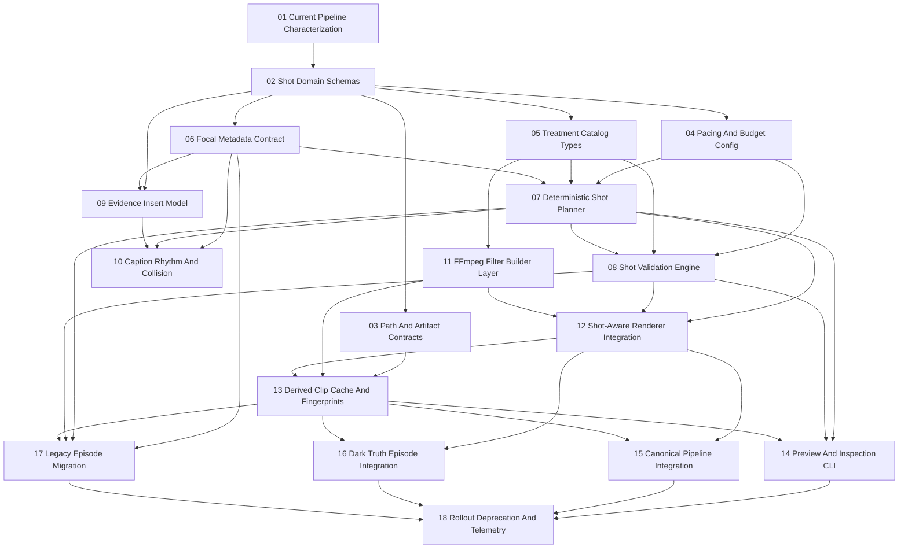

# Dependency Graph

## Parallel Branches

- Branch A: Tasks 04, 05, 06 after Task 02.
- Branch B: Task 09 after Task 02 and Task 06.
- Branch C: Task 11 after Task 05.
- Branch D: Tasks 14 and 17 after Task 13.

## Integration Points

- Domain schema freeze: Task 02.
- Path/artifact freeze: Task 03.
- Planner contract freeze: Task 07.
- Renderer contract freeze: Task 12.
- Cache and resume freeze: Task 13.
- Production behavior integration: Tasks 15 and 16.

