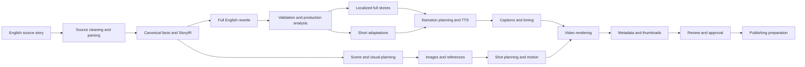
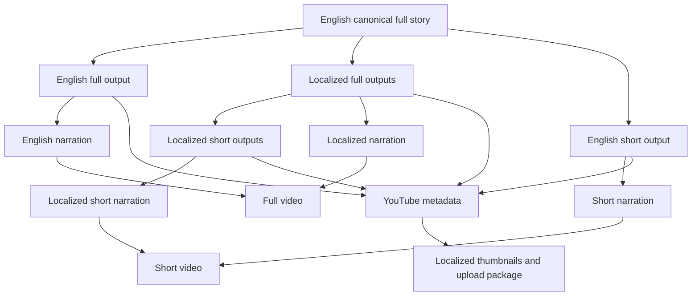
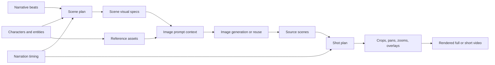
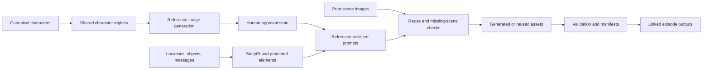
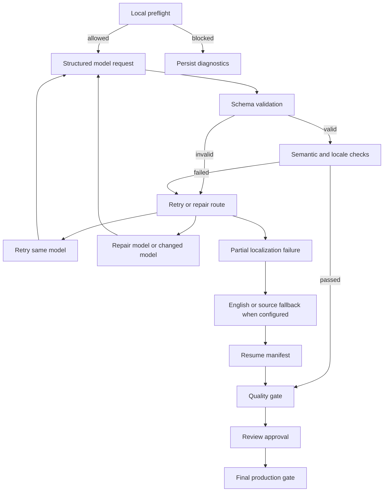
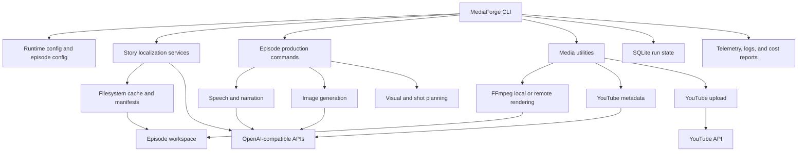
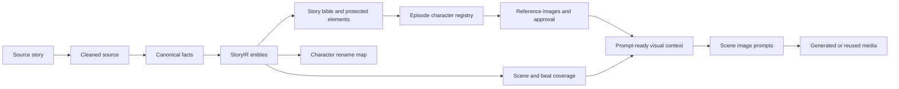

# MediaForge Product Paper

## Product overview

MediaForge is a CLI-first production platform for turning source stories into localized narration, visual assets, videos, thumbnails, metadata, and YouTube publishing packages. The implementation is a TypeScript `pnpm` monorepo centered on `apps/cli`, with specialized packages for story localization, speech, image generation, shot planning, rendering, metadata, upload, persistence, and observability.

The product is built for story-driven channels that need repeatable output across full-length and short-form formats. It is not a single black-box generator. It is a controlled production system with persisted artifacts, validation gates, resumable stages, and human review points.

## Problem the product solves

Story-to-video production usually fails at handoffs: rewrites drift from the source, localized versions lose key facts, characters change appearance, narration timing breaks scene plans, generated images are hard to reuse, and publishing metadata becomes a separate manual task. MediaForge addresses those production gaps by separating the workflow into accountable stages with contracts, fingerprints, cache state, and operator commands.

## Target users

The primary users are AI-assisted media teams, YouTube channel operators, localization teams, short-form content teams, and technical production partners. It also fits studios building repeatable narrative franchises, agencies producing multilingual video packages, and investors or platform partners evaluating scalable AI media operations.

## Core value proposition

MediaForge reduces production variance. It keeps stories, localization, narration, images, motion, rendering, thumbnails, and publishing preparation connected through traceable artifacts. Customers get faster iteration, fewer repeated provider calls, stronger continuity, and a clearer operational boundary between automation and review.

## Main product capabilities

The repository verifies support for source preparation, canonical full-story rewriting, localized full stories, short adaptations, story intelligence modeling, character registries, reference-image workflows, narration generation, audio validation, scene planning, image generation, thumbnail generation, visual-retention shot planning, video rendering, YouTube metadata, YouTube upload, batch workflows, retry handling, telemetry, and cost estimation.

Feature maturity is uneven by design. Core CLI flows are available. Some roadmap-style workflow unification is in development. API and web surfaces are minimal. TikTok publishing is not verified.

## Story intelligence and narrative modelling

MediaForge extracts canonical facts from source stories and builds structured story context. The implemented model includes entities, immutable facts, chronology, genre, fictionality, narrative mode, central threat, rules or mechanisms, critical objects, written messages, climax, and ending consequence.

This matters commercially because downstream generation can be guided by source truth rather than free-form prompting. Full-story contracts and short-adaptation contracts help preserve reveals, endings, written messages, and core objects across languages and formats.

## Character Maps and Continuity Management

MediaForge supports a practical character-map capability under several internal names: canonical facts, StoryIR entities, story bible cast, deterministic character rename maps, and per-episode character registries.

Verified capabilities include automatic extraction of candidate characters from source narration, canonical person entities with stable IDs, names, roles, aliases, textual relationships, deterministic localization-safe fictional names, and validation for original-name leakage. The story bible records cast members, roles, key objects, written messages, story rules, and scene order. The image pipeline stores richer visual character definitions: physical description, age range, gender presentation, face, hair, build, wardrobe, accessories, carried objects, continuity traits, reference image path, file ID, and approval status.

Scene image jobs carry character IDs and reference-image paths, while scene visual specs can include character usage, pose, expression, position, visible features, and unresolved recurring character mentions. Operators can sync characters into a shared episode workspace, generate character reference images, approve or regenerate those references, and resume image generation while controlling whether unapproved references are allowed.

The customer value is concrete: fewer visual inconsistencies inside an episode, more recognizable recurring characters, safer localized names, better prompt context, easier reference reuse, and lower regeneration cost. The repository does not verify face-level identity consistency, automatic cross-franchise identity management, or full visual-appearance conflict detection across episodes, so those should not be sold as completed features.

## End-to-end production workflow

The implemented workflow starts with source discovery and parsing, then cleans production contamination, extracts facts, rewrites English full narration, validates and analyzes the result, localizes full scripts, creates short adaptations, plans narration, generates or validates audio, builds scene and image plans, generates or imports images, creates shots, renders video, generates thumbnails and metadata, and prepares upload artifacts.

## Localization and multi-format publishing

Story localization supports English plus German, Spanish, French, and Portuguese profiles. It can generate canonical English full stories, localized full stories, English shorts, and localized shorts. The media-oriented episode commands are narrower in places and are verified for English, German, Spanish, and French.

Localized output is not treated as plain translation. Language profiles include narration pace, word ranges, style guidance, hashtags, and locale checks. Validation catches wrong-language output, locale leakage, boilerplate, truncation, and missing critical story elements.

## Narration and audio quality

The staged narration pipeline prepares spoken text, splits it into chunks, builds performance direction, applies pronunciation transforms, generates TTS, assembles audio, masters it, and runs a quality gate. Voice settings support restrained documentary-style delivery, language-specific pacing, pronunciation stability, and avoidance of production text.

Audio validation checks decodability, duration, expected duration range, WPM drift, silence, sample rate, channels, and WAV quality metrics. Rollout modes allow legacy, shadow, and new behavior so teams can inspect staged outputs before promoting them into render paths.

## Visual planning and media generation

MediaForge plans scenes, visual specs, image prompts, source scenes, and deterministic shot plans. Visual scene specs include focal subject, visible action, environment, foreground, background, shot size, camera angle, camera movement impression, composition, lighting, time of day, mood, distinctive anchor, text requirements, continuity elements, and character usage.

The visual-retention system turns fewer source images into multiple rendered shots using crops, pans, zooms, overlays, and transitions. It validates opening variety, static duration, reuse limits, repeated motion, caption collisions, evidence provenance, low-resolution crop risk, and face clipping risk.

## Reusable assets and cross-episode consistency

The strongest implemented reuse is episode-scoped. Character registries, reference images, scene manifests, image checkpoints, batch manifests, and derived shot caches let operators skip completed work, retry only failed work, and preserve approved references.

## Automation and batch processing

MediaForge supports batch story localization, image batch manifests, batch refresh, import, retry, cancel, index verification, and rebuild commands. Operators can run dry plans, submit OpenAI batches, import ready batches, and handle partial completion without recomputing the entire episode.

## Validation, recovery, and quality controls

Validation exists at multiple levels: schemas, source cleaning, token-budget preflight, story contracts, locale checks, short adaptation checks, production analysis, audio quality gates, image validation, shot validation, render validation, review approval, and upload reports.

## Cost-efficiency features

Cost controls include dry-run modes, validation-only modes, concurrency limits, token preflight, cached input token accounting, story caches, narration chunk caches, image resume checkpoints, image reuse, derived shot clip caching, and visual-retention savings estimates. Pricing catalogs are configurable; without pricing, usage is still recorded but dollar estimates may be unavailable.

## Security and data handling

The runtime loads secrets from environment and config, while telemetry redacts sensitive fields in documented narration paths. Source ingestion blocks private and localhost URL hosts for remote source adapters. Generated state is filesystem-first in episode workspaces, with SQLite used for run state where flows opt in. The product should still be deployed with normal secret-management controls because provider keys, YouTube credentials, and generated customer content pass through local execution.

## Technical architecture overview

The architecture is modular. The CLI coordinates domain contracts, source ingestion, story localization, speech, image generation, visual planning, rendering, metadata, YouTube upload, persistence, process execution, and observability. External dependencies include OpenAI-compatible APIs, whisper.cpp, ffmpeg, optional remote render workers, and YouTube APIs.

## Deployment and operational model

MediaForge runs as a Node 22+ monorepo and is operated primarily through CLI commands and package scripts. Episode workspaces default under `./episodes`. Runtime configuration comes from environment variables, `.env`, CLI overrides, and optional episode config. Rendering uses local ffmpeg or remote SSH/rsync workers with local fallback.

## Current product maturity

The available product is a strong production toolkit rather than a polished SaaS UI. Core capabilities are implemented in code and tests, especially for CLI workflows, story generation, localization, narration, images, shot planning, rendering, metadata, review, and upload. Unified workflow manifests are in development. API and web surfaces are experimental/minimal. Cross-episode identity management and TikTok publishing are not verified.

## Example use cases

MediaForge can support a multilingual horror/documentary YouTube channel, a story franchise with recurring visual assets, a localization studio producing multiple language variants from one English source, a short-form derivative workflow, and a production team needing auditable AI content operations.

## Commercial benefits

Customers gain repeatable output, lower rework, reusable creative assets, better language coverage, controlled review gates, more reliable publishing packages, and clearer cost visibility. Partners gain a modular architecture that can integrate with external providers and existing post-production workflows.

## Closing summary

MediaForge turns AI media generation from isolated prompts into a traceable production system. Its strongest value is operational discipline: structured story intelligence, practical character continuity, localized narration, media reuse, validation, recovery, and publishing preparation in one CLI-centered workflow.

## Feature matrix

| Product area | Capability | Customer benefit | Status |
| ------------ | ---------- | ---------------- | ------ |
| Content preparation | Source parsing, cleaning, transcript normalization | Cleaner inputs and fewer rewrite errors | Available |
| Narrative intelligence | Canonical facts, StoryIR, contracts, production analysis | Source-faithful generation and review | Available |
| Character maps | Cast, entities, rename maps, visual registries, references | Better continuity and reusable prompts | Partially available |
| Story and entity continuity | Protected elements, objects, messages, rules, climax, ending | Less drift across formats | Available |
| Localization | Full and short story localization for `de`, `es`, `fr`, `pt` | Multilingual publishing from one source | Available |
| Narration | Chunked TTS, performance direction, pronunciation, mastering | More natural and inspectable audio | Available |
| Scene and shot planning | Scene segmentation, visual specs, deterministic shot plans | Better pacing and fewer manual edits | Available |
| Visual generation | Scene images, references, batch generation, reuse | Scalable art production | Available |
| Reusable asset management | Shared character assets, image checkpoints, derived shot cache | Lower regeneration cost | Available |
| Video rendering | Full/short ffmpeg rendering, local/remote, validation | Publishable video outputs | Available |
| Thumbnail generation | Reference-based localized thumbnails and text composition | Faster packaging for YouTube | Available |
| Metadata and publishing | YouTube metadata and upload reports | Faster channel operations | Available |
| Workflow automation | CLI scripts, batch manifests, workflow planning | Repeatable production runs | Partially available |
| Validation and review | Story, locale, audio, image, shot, render, approval gates | Reduced production risk | Available |
| Reliability and recovery | Retry, repair, fallback, resume, invalidation | Less wasted work after failures | Available |
| Observability and cost control | Telemetry, pricing, token/image/audio cost hooks | Better operational decisions | Available |

## Story intelligence and character-map flow

