# History V3.4 Pipeline — Repository Analysis

Phase 00 analysis. All paths, symbols, and commands verified against the repository on 2026-08-07.

## Pipeline overview

```mermaid
flowchart LR
  script["languages/script-en.md"] --> norm["normalizeHistoryNarrationV33"]
  norm --> units["narration units"]
  units --> claims["structureTrustedScriptClaimsV34"]
  claims --> entities["entities / qualifiers"]
  entities --> planner["buildHistoryVisualPlanV34"]
  planner --> visuals["maps / diagrams / timelines"]
  visuals --> beats["beats + shots"]
  beats --> ratios["buildRatioPlans 16:9 + 9:16"]
  ratios --> gates["summarizeApproval diagnostics"]
  gates --> pack["createHistoryApprovalPackV34 → ZIP"]
```



Authority mode is `trusted-script` (no web research). The V3.4 planner reads `languages/script-en.md` via `episodePaths()` in `packages/history/src/history-workflow-v34.ts`. Import lineage records `source/canonical-narration-en.md` per `packages/history/src/content-pack.ts` (lines 714–715).

---

## 1. Canonical episode roots (02–05)

| Pack | Subject | Episode ID suffix |
|------|---------|-------------------|
| 02 | Napoleon's Invasion of Russia | `02-napoleons-invasion-of-russia` |
| 03 | Fall of the Roman Empire | `03-fall-of-the-roman-empire` |
| 04 | Black Death | `04-black-death` |
| 05 | Franklin Expedition | `05-franklin-expedition` |

For each episode, the canonical root is:

`episodes/history-youtube-history-10-video-story-pack-{NN}-{slug}/`

| Artifact | Path |
|----------|------|
| Planner narration (runtime) | `languages/script-en.md` |
| Import lineage narration | `source/canonical-narration-en.md` |
| Metadata | `source/normalized-metadata.json` |
| Generated V3.4 plan | `source/history-v3.4/plan.json` |
| Current review pack | `artifacts/chatgpt-review/history-youtube-history-10-video-story-pack-{NN}-{slug}-v3.4/` + sibling `.zip` |
| Reference pack (do not patch) | `episodes/history-youtube-history-10-video-story-pack-{NN}-{slug}-v3.4/` |

**File presence (verified):** `canonical-narration-en.md` exists for 02–04; **missing for 05**. All four have `script-en.md`, `normalized-metadata.json`, and `source/history-v3.4/plan.json`.

**Overlap/conflict:** Three v3.4 locations exist per episode. SHA-256 prefixes of `plan.json` (verified):

| Episode | Canonical | `artifacts/chatgpt-review/` | `episodes/*-v3.4/` |
|---------|-----------|----------------------------|---------------------|
| 02 Napoleon | `2b3150e582a4aba2` | matches canonical | `b225038bd971991b` (stale) |
| 03 Rome | `42aa45357e06d886` | matches canonical | `0b23f7753c643709` (stale) |
| 04 Black Death | `7b90d0e11791572f` | matches canonical | `6a7b600721ddf46a` (stale) |
| 05 Franklin | `7aa28d19422ed71c` | matches canonical | `00fbdafd160ef332` (stale) |

Treat `episodes/*-v3.4/` as extracted reference approval packs (stale). Use `artifacts/chatgpt-review/` and canonical `source/history-v3.4/` as current generated state. Combined bundle: `artifacts/chatgpt-review/history-approval-packs-v3.4/` + `.zip`.

---

## 2. Claims and semantic typing

| Stage | File | Key symbols |
|-------|------|-------------|
| Narration segmentation | `packages/history/src/history-narration-v33.ts` | `normalizeHistoryNarrationV33`, `assertCanonicalNarrationV33` |
| Claim creation | `packages/history/src/history-claims-v34.ts` | `structureTrustedScriptClaimsV34`, `stableClaimIdV34`, `detectClaimKind`, `isRhetoricalUnit` |
| Temporal parsing | same | `extractTemporal`, `extractTemporalAndQuantitative` |
| Quantitative parsing | same | `extractQuantitative` |
| Entity typing | `history-claims-v34.ts` + `history-v34-contracts.ts` | `extractEntitiesForUnit`, `isRejectedEntityTextV34`, `roleForEntity`, `CANONICAL_ENTITY_SEEDS`, `ENTITY_BY_ALIAS` |
| Geographic qualifiers | `history-claims-v34.ts` | `geographicFromEntities`, `validateGeographicRolesV34` |
| Trust attestation | `packages/history/src/history-trusted-script-v33.ts` | `createTrustedNarrationAttestationV1`, `isTrustedAttestationValidV1` |
| Orchestration | `packages/history/src/history-workflow-v34.ts` | `structureHistoryTrustedScriptV34`, `planHistoryVisualsV34` |
| CLI | `apps/cli/src/history-commands.ts` | `history authoring structure-trusted-script`, `history visuals plan --planner-version v3.4` |

**Call sequence (structure trusted claims):**

1. CLI → `structureHistoryTrustedScriptV34` (`history-workflow-v34.ts`)
2. `ensureTrustedAttestation` (see defect note below)
3. `normalizeHistoryNarrationV33` (`history-narration-v33.ts`) — paragraph split, `Intl.Segmenter` sentence units, deterministic unit IDs
4. `structureTrustedScriptClaimsV34` (`history-claims-v34.ts`) — per unit: `detectClaimKind`, `extractEntitiesForUnit`, `extractTemporal`/`extractQuantitative`, `geographicFromEntities`, `stableClaimIdV34`
5. `validateStructuredClaimsV34` → writes `source/history-v3.4/structured-claims.json` and `claims-validation.json`

Claims carry `trustAttestationId` from `trusted-narration-attestation.json` (`source/history-v3.3/` or `source/history-v3.4/`). V3.4 rejects `trusted-claim-*` IDs; only `claim-*` namespace is valid.

**Source defect:** `ensureTrustedAttestation` is called at lines 238 and 331 of `history-workflow-v34.ts`, but no function declaration exists — only an orphaned body block at lines 196–220.

---

## 3. Visual modality pipeline

| Concern | File | Symbols |
|---------|------|---------|
| Visual-purpose creation | `packages/history/src/visual-planner-v34.ts` | `buildHistoryVisualPlanV34` |
| Modality selection | same | `modalityFor`, `clusterBeats` |
| Map intent + compile | `packages/history/src/history-geo-v34.ts` | `proposeMapIntentsV34`, `compileMapStateV34`, `validateCompiledMapStateV34`, `resolveHistoryPlaceV34`, `collectEpisodePlacesV34` |
| Diagram proposal + validation | `visual-planner-v34.ts` | `compileDiagram` (private; returns `null` when graph invalid) |
| Timeline creation | same | `compileTimelineOrDateCard`, `dedupeNestedTemporals`, `compileDocument` |
| Fallbacks | `buildHistoryVisualPlanV34` (~916–1000) | failed map/diagram → `selectedFallback: "archival image"`; failed timeline → `"text-only transition"`; recorded in `fallbackDecision` and `mediaDecisions[].rejectedModalities` |

**Call sequence (plan visuals):** CLI → `planHistoryVisualsV34` → `structureHistoryTrustedScriptV34` → `buildHistoryVisualPlanV34` (uses `proposeMapIntentsV34`/`compileMapStateV34` from `history-geo-v34.ts`) → `validateHistoryVisualPlanV34` → writes `source/history-v3.4/plan.json`.

Map semantic blockers originate in `history-geo-v34.ts` (`MAP_ORIGIN_UNRESOLVED`, `MAP_DESTINATION_UNRESOLVED`, `MAP_IDENTITY_ROUTE`, `MAP_ACTOR_INVALID`, `MAP_COORDINATES_MISSING`, etc.) and surface in the planner as `MAP_SEMANTIC_BLOCKED`.

---

## 4. Beats and shots

All in `packages/history/src/visual-planner-v34.ts`:

- **Semantic grouping:** `clusterBeats` — merges narration units by modality (≤90 words, <3 units; no merge for map/timeline)
- **Long-beat handling:** `buildShotsForBeat` — `needsMultiple` when `durationMs >= 45_000`, `claimIds.length >= 3`, or modality is map/diagram/timeline
- **Shot count:** `count = needsMultiple ? Math.min(3, Math.max(2, Math.ceil(durationMs / 40_000))) : 1`
- **Shot grammar:** roles `orienting`, `evidentiary`, `explanatory`, `transitional`, `emotional`; deterministic selection via `hashPick`; types in `HistoryShotV34` (`history-v34-contracts.ts`)
- **Repetition:** `measureHistoryRepetitionV34` (exported) — metrics include `exactPurposeDuplicateRate`, `semanticPurposeDuplicateRate`, `dominantCameraRate`, `oneShotPerLongBeatRate`
- **Threshold enforcement:** `DEFAULT_HISTORY_QUALITY_THRESHOLDS_V34.maxOneShotPerLongBeatRate` in contracts; diagnostic `EDITORIAL_REPETITION_THRESHOLD`; post-build `validateHistoryVisualPlanV34`

Timing uses V3.3 helpers: `estimateHistoryTimingV33`, `allocateHistoryTimingV33` (`history-narration-v33.ts`).

---

## 5. Ratio planning

- **Builders:** `buildRatioPlans` (private) in `visual-planner-v34.ts` — two `AspectRatioPlanV34` records per beat (landscape `16:9` + portrait `9:16`)
- **16:9:** `retainedLabels: mapLabels`, `removedLabels: []`, full nodes/edges/events
- **9:16:** `retainedLabels: mapLabels.slice(0, 2)`, `removedLabels: mapLabels.slice(2)`, truncated nodes/edges/events; `independentPortraitRenderingMandatory: true`
- **Collision/density:** portrait `conflictDiagnostics` codes — `MAP_LABEL_OVERFLOW_PORTRAIT`, `DIAGRAM_NODE_OVERFLOW_PORTRAIT`, `TIMELINE_EVENT_OVERFLOW_PORTRAIT`, `MAP_LABELS_MISSING`, `MAP_LABEL_FOOTPRINT_TIGHT`; `textDensityResult` is `pass`, `warning`, or `block`
- **End-screen extension point:** no dedicated hook today. Natural insertion surface: `cropBounds`, `legendPlacement`, `minimumTextSizePx` on `AspectRatioPlanV34` (`history-v34-contracts.ts`). Phase 04 targets `publishing/end-screen-plan.json` (not yet in pipeline).

---

## 6. Approval gates

Rollup: `summarizeApproval` → `HistoryApprovalV34` booleans (`structurallyValid`, `editoriallyReviewable`, `contentApprovalEligible`, `productionApprovalEligible`) in `history-v34-contracts.ts`. Human-readable summary: `approvalMarkdown` in `history-workflow-v34.ts`.

| Gate | Blocker codes |
|------|---------------|
| **Structural** | `MAP_STATE_MISSING`, `DIAGRAM_STATE_MISSING`, `TIMELINE_STATE_MISSING`, `DOCUMENT_STATE_MISSING` |
| **Editorial** | `TIMELINE_TOO_FEW_EVENTS`, `TIMELINE_LABEL_TRUNCATED`, `RATIO_ANALYSIS_NOT_EVALUATED`, `MAP_SEMANTIC_BLOCKED`, `DIAGRAM_EMPTY_OR_BLOCKED`, `TIMELINE_ORDER_INVALID`, `EDITORIAL_REPETITION_THRESHOLD`; warnings: `ALL_CLAIMS_MATERIAL`, `TIMING_PREFERRED_DEVIATION`, `ONE_BEAT_PER_UNIT_DOMINANCE` |
| **Content** | `QUOTATION_NOT_VERBATIM`, `GEOGRAPHIC_ROLE_MISMATCH`, `QUANTITATIVE_QUALIFIER_INVALID`, `TRUSTED_PROVENANCE_MISMATCH`, `FAKE_INDEPENDENT_VERIFICATION` |
| **Production** | `TIMING_OUTSIDE_ALLOWED_RANGE`, `TIMING_MEASUREMENT_REQUIRED` |

Map sub-blockers (in `history-geo-v34.ts`, surfaced via `MAP_SEMANTIC_BLOCKED`): `MAP_ORIGIN_UNRESOLVED`, `MAP_DESTINATION_UNRESOLVED`, `MAP_IDENTITY_ROUTE`, `MAP_ACTOR_STOPWORD`, `MAP_ACTOR_TEMPORAL_FRAGMENT`, `MAP_DESTINATION_NOT_PLACE`, `MAP_DESTINATION_PERSON`, `MAP_ROUTE_TYPE_NONE`, `MAP_ROUTE_TYPE_INVALID`, `MAP_ROUTE_TYPE_CONTRADICTION`, `MAP_PERIOD_FROM_QUANTITY`, `MAP_COORDINATES_MISSING`, `MAP_PLACEHOLDER_COORDINATES`, `MAP_CLAIM_MISSING`.

---

## 7. Semantic-provider boundary

- **No V3.4 semantic provider interface.** Optional `semanticProposals[]` intake in `structureTrustedScriptClaimsV34`; application code owns IDs, spans, and types.
- **No-web default:** `semanticStructuring: false`, `providerCalls: 0`, `webSearchCalls: 0`. `--semantic-structuring` CLI flag is fail-closed — `structureHistoryTrustedScriptV34` throws in offline/CI mode.
- **V3.3 research providers** (separate system): `ClaimExtractionProviderV3_3`, `SourceRetrievalProviderV3_3`, `EvidenceAssessmentProviderV3_3`, `VisualPurposeProviderV3_3` in `history-research-v33.ts`. Cache: `history-research-cache-v33.ts`. No V3.4 semantic cache.
- **Credentials:** trusted-script V3.4 path requires no `OPENAI_API_KEY` (`docs/history-channel-paid-providers-readme.md`).
- **Deterministic validation after any model output:** `validateStructuredClaimsV34` + `validateHistoryVisualPlanV34`. Approval pack writes `validation.json`, `determinism-report.json`, `checksums.sha256`.

---

## 8. Verified commands

**Import (prerequisite):**

```bash
pnpm mediaforge -- content-pack import content-packs/youtube-history-10-video-story-pack --genre history --strict --collect-errors --json
```

**V3.4 single-episode pipeline:**

```bash
EPISODE=history-youtube-history-10-video-story-pack-05-franklin-expedition
pnpm mediaforge -- history authoring trust-script "$EPISODE" --json
pnpm mediaforge -- history authoring structure-trusted-script "$EPISODE" --json
pnpm mediaforge -- history authoring validate-trusted-claims "$EPISODE" --json
pnpm mediaforge -- history visuals plan "$EPISODE" --planner-version v3.4 --force --json
pnpm mediaforge -- history visuals inspect "$EPISODE" --planner-version v3.4 --json
pnpm mediaforge -- history visuals validate "$EPISODE" --planner-version v3.4 --json
```

**Approval ZIP:**

```bash
REVIEW_DIR="artifacts/chatgpt-review/${EPISODE}-v3.4"
pnpm mediaforge -- history visuals review-bundle "$EPISODE" \
  --planner-version v3.4 --output "$REVIEW_DIR" --regenerate --json
```

Canonical commands embedded in `determinism-report.json` (`history-workflow-v34.ts`):

```bash
pnpm exec tsx apps/cli/src/index.ts history visuals plan <episode-id> --planner-version v3.4 --force --json
pnpm exec tsx apps/cli/src/index.ts history visuals review-bundle <episode-id> --planner-version v3.4 --output <dir> --regenerate --json
```

**Focused History tests (exist today):**

```bash
pnpm test:focused -- packages/history/src/history-v34.unit.test.ts
pnpm test:focused -- apps/cli/src/history-commands.unit.test.ts
```

**Generated-artifact acceptance tests:** specified in `prompts/history-v34-cursor/01-franklin-golden-fixture.md` et al. as `packages/history/test/acceptance/*.acceptance.ts` — **directory does not exist yet**.

**Deterministic second generation:** re-run `review-bundle` with same inputs; compare `zipSha256` from JSON output or `sha256sum "$REVIEW_DIR.zip"`.

**ZIP/checksum verification:**

```bash
unzip -l "$REVIEW_DIR.zip"
sha256sum "$REVIEW_DIR.zip"
```

In-pack `checksums.sha256` is verified programmatically in `packages/history/src/history-v33.unit.test.ts` (pattern for V3.4 packs).

**Not available:** CLI for `createCombinedHistoryApprovalBundleV34` (function exists in `history-workflow-v34.ts`, no CLI registration). V3.3 combined compare: `pnpm mediaforge -- history v3.3 compare <ep-a> <ep-b> <ep-c> --output <dir> --regenerate --json`.

---

## 9. Minimal defect-to-file map

| Next-phase requirement | Likely source files |
|------------------------|---------------------|
| Franklin maps + evidence graphic | `history-geo-v34.ts`, `visual-planner-v34.ts` (`compileMapStateV34`, `buildShotsForBeat`) |
| Napoleon maps + logistics diagram | same + `compileDiagram` |
| Rome + Black Death generalization | `history-claims-v34.ts` (`CANONICAL_ENTITY_SEEDS`, `extractEntitiesForUnit`), `history-geo-v34.ts` place seeds |
| Entity/qualifier correctness | `history-claims-v34.ts`, `history-v34-contracts.ts` |
| Beat and shot quality | `visual-planner-v34.ts` (`clusterBeats`, `measureHistoryRepetitionV34`) |
| Ratio planning | `visual-planner-v34.ts` (`buildRatioPlans`), `history-v34-contracts.ts` thresholds |
| Artifact acceptance scripts | **to create:** `packages/history/test/acceptance/{franklin,napoleon,fall-of-rome,black-death,history-v34-portfolio}-v34.acceptance.ts` |
| Publishing output | `docs/history-channel-paid-providers-readme.md`; Phase 04 `publishing/*` artifacts; CLI `stories audio generate`, `images generate`, `render`, `youtube upload` |

---

## Known risks

1. `ensureTrustedAttestation` missing function declaration in `history-workflow-v34.ts`
2. Franklin missing `source/canonical-narration-en.md`
3. `episodes/*-v3.4/` reference packs stale vs canonical plans
4. No V3.4 generated-artifact acceptance tests yet
5. `createCombinedHistoryApprovalBundleV34` has no CLI entry point
